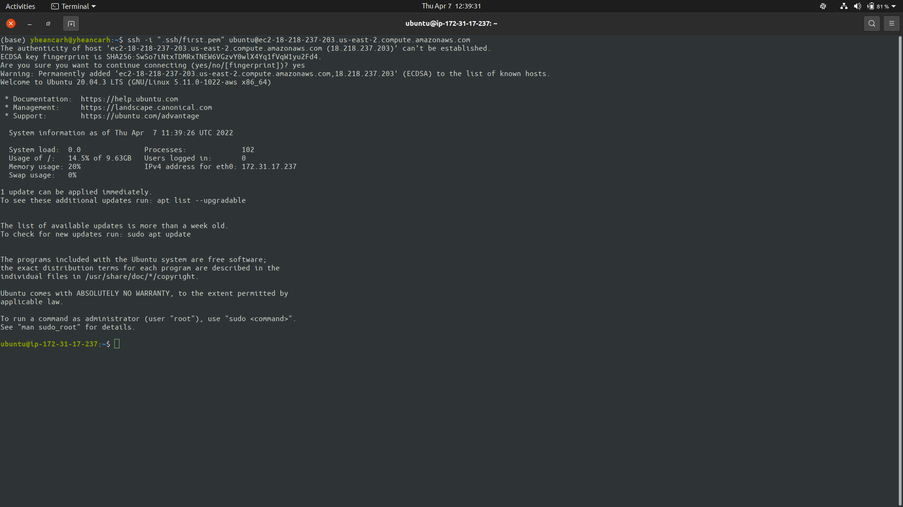
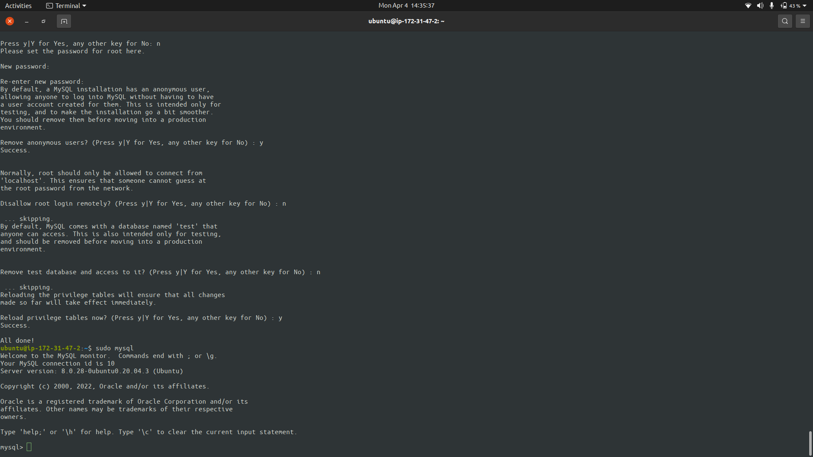

# LAMP STACK IMPLEMENTATION

## STEP 0
### Create AWS account


### Create and Launch an EC2 instance


### Connect to the EC2 instance



## STEP 1

### Installing Apache
```bash
	sudo apt update

	sudo apt install apache2

	# Verifying that apache is installed
	sudo systemctl status apache2
```


### Apache on instance URL
> http://\<Public-IP-Address\>:80


## STEP 2

### Installing MySQL
```bash
	sudo apt install mysql-server

	# Setup user
	sudo mysql_secure_installation
```



## STEP 3

### Installing PHP
```bash
	sudo apt install php libapache2-mod-php php-mysql

	# Verify that php is installed
	php -v
```


## STEP 4

### Creating Virtual host for the website using apache
```bash
	sudo mkdir /var/www/projectlamp

	# Change Directory Ownership
	sudo chown -R ubuntu:ubuntu /var/www/projectlamp

	# Write into config file
	sudo vim /etc/apache2/sites-available/projectlamp.conf
```

```xml
	<!-- Content of projectlamp.conf -->
	<VirtualHost *:80>
		ServerName projectlamp
		ServerAlias www.projectlamp 
		ServerAdmin webmaster@localhost
		DocumentRoot /var/www/projectlamp
		ErrorLog ${APACHE_LOG_DIR}/error.log
		CustomLog ${APACHE_LOG_DIR}/access.log combined
	</VirtualHost>
```

```bash
	# Enable new Virtual Host
	sudo a2ensite projectlamp

	# Disable default Virtual Host
	sudo a2dissite 000-default

	# Verify that there are no syntax errors in projectlamp.conf
	sudo apache2ctl configtest

	# Reload Apache2
	sudo systemctl reload apache2

	# Create index.html file in the /var/www/projectlamp directory
	sudo echo 'Hello LAMP from hostname' $(curl -s http://169.254.169.254/latest/meta-data/public-hostname) 'with public IP' $(curl -s http://169.254.169.254/latest/meta-data/public-ipv4) > /var/www/projectlamp/index.html
```


> Visiting the public URL page
> http://\<Public-IP-Address\>:80


## STEP 5

### Enabling PHP on the website
```bash
	# Changing the files' order of precedence
	sudo vim /etc/apache2/mods-enabled/dir.conf
```
```xml
	<IfModule mod_dir.c>
        #Change this:
        #DirectoryIndex index.html index.cgi index.pl index.php index.xhtml index.htm
        #To this:
        DirectoryIndex index.php index.html index.cgi index.pl index.xhtml index.htm
	</IfModule>
```
```bash
	# Restart Apache
	sudo systemctl reload apache2

	# Create index.php file
	vim /var/www/projectlamp/index.php
```

```php
	<?php
	phpinfo();
```


