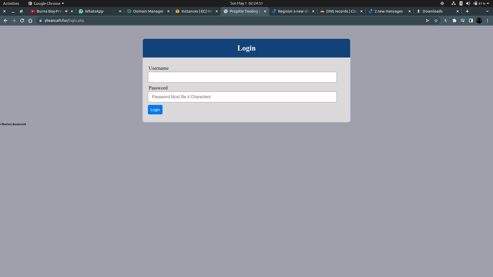

# Load Balancer Solution With NGINX

## Install NGINX

```bash
# Install NGINX
sudo apt update
sudo apt install nginx

# Set Web Server hosts
sudo vim /etc/hosts

# Load Balancer Configuration
sudo vim /etc/nginx/nginx.conf

# Restart NGINX
sudo systemctl restart nginx

sudo systemctl status nginx
```


## Register Domain and Link to Elastic IP on EC2 Instance


## Install certbot and request for a SSL/TLS certificate

```bash
# Check if snap is running
sudo systemctl status snapd

# Install certbot
sudo snap --classic certbot

sudo ln -s /snap/bin/certbot /usr/bin/certbot

# Request Certificate
sudo certbot --nginx

# Test renew command
sudo certbot renew --dry-run

# Add to crontab
crontab -e
```

### Content to add to crontab
> __* */12 * * *   root /usr/bin/certbot renew > /dev/null 2>&1__





