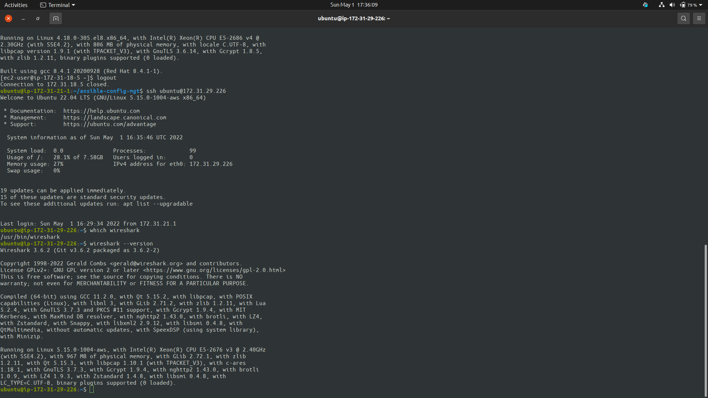

# Automate Project 7 to 10

### Install Ansible on the Jenkins EC2 Instance

```bash
sudo apt update

sudo apt install ansible

# Verify installation
ansible --version
```


### Create a new Repository on github and configure a new build job for it on Jenkins


### Create a webhook and test it


### Set up Ansible Inventory

> Set up the directory in the repository as shown below


### Connect to the EC2 Instance

```bash
eval `ssh-agent -s`

ssh-add <path-to-private-key>

ssh -A <user>@<Public-IP-Address>

ssh-add -l
```


### Update Files

#### Update inventory/dev.yml with the code below

```yaml
--
[nfs]
<NFS-Server-Private-IP-Address> ansible_ssh_user='ec2-user'

[webservers]
<Web-Server1-Private-IP-Address> ansible_ssh_user='ec2-user'
<Web-Server2-Private-IP-Address> ansible_ssh_user='ec2-user'

[db]
<Database-Private-IP-Address> ansible_ssh_user='ec2-user' 

[lb]
<Load-Balancer-Private-IP-Address> ansible_ssh_user='ubuntu'
```

#### Update playbooks/common.yml with the code below

```yaml
---
- name: update web, nfs and db servers
  hosts: webservers, nfs, db
  remote_user: ec2-user
  become: yes
  become_user: root
  tasks:
    - name: ensure wireshark is at the latest version
      yum:
        name: wireshark
        state: latest

- name: update LB server
  hosts: lb
  remote_user: ubuntu
  become: yes
  become_user: root
  tasks:
    - name: Update apt repo
      apt: 
        update_cache: yes

    - name: ensure wireshark is at the latest version
      apt:
        name: wireshark
        state: latest

```

### Commit the code to github

```bash
git add .

git commit -m "Commit Message"
```

### Create a Pull Request and Merge into main and check the build in jenkins


### Clone the Repository into the EC2 Instance and run the playbook

```bash
git clone <github-repository>

cd ansible-config-mgt

ansible-playbook -i inventory/dev.yml playbooks/common.yml
```


### Confirm Installation of wireshark on the servers




### Create Directory, Files and Set Timezone

#### Append the tasks below to the common.yml 

```yaml
- name: Create directory, file and set timezone on all servers
  hosts: webservers, nfs, db, lb
  become: true
  tasks: 

    - name: Create a Directory
      file:
        path: /home/sample
        state: directory
    
    - name: Create a File
      file:
        path: /home/sample/ansible.txt
        state: touch
    
    - name: Set Timezone
      timezone:
        name: Africa/Lagos
```


