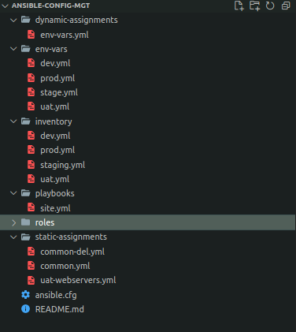
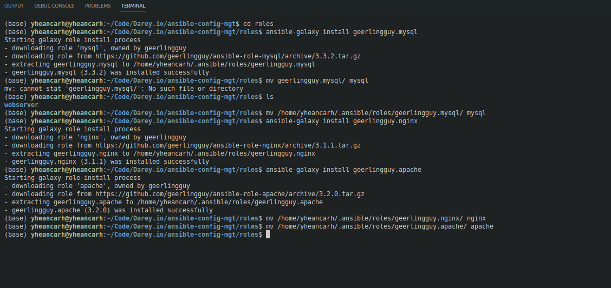
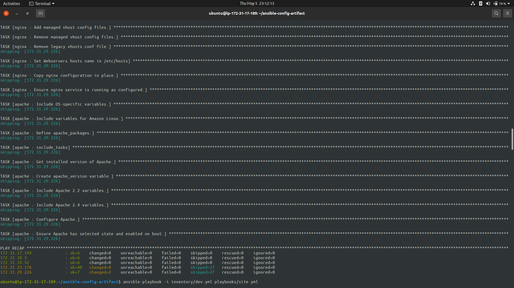
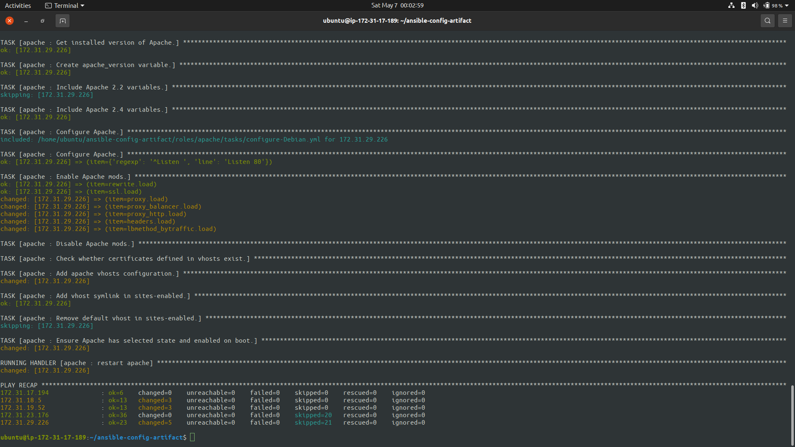

# Ansible Dynamic Assignments (include) and Community Roles

## Dynamic Assignment

- Create a new branch on the __ansible-config-mgt__ repo and name it __dynamic-assignments__
- Create a new directory and name it __dynamic-assignments__
- Inside the __dynamic-assignments__ directory create a new file __env-vars.yml__

### Since ansible will be used to configure multiple environments

- Create a new directory in the named __env-vars__ in __ansible-config-mgt__
- In the __env-vars__ directory create the files __dev.yml__, __stage.yml__, __uat.yml__, __prod.yml__




## Edit the __env-vars.yml__ file
```yml
---
- name: Collate Variablesfrom env specific file, if it exists
  hosts: all
  tasks: 
    - name: Looping through list of available files
      include_vars: "{{ item }}"
      with_first_found:
        - files:
            - dev.yml
            - stage.yml
            - prod.yml
            - uat.yml
          paths:
            - "{{ playbook_dir }}/../env-vars"
      tags:
        - always
```

## Update the __site.yml__ file with Dynamic Assignments
```yml
---
- name: Include dynamic variables
  hosts: all
  import_playbook: ../static-assignments/common-del.yml
  include: ../dynamic-assignments/env-vars.yml
  tags:
    - always

- hosts: uat-webservers
  import_playbook: ../static-assignments/uat-webservers.yml
```

## Download Ansible Roles (mysql, nginx and apache)
```bash
cd roles/

ansible-galaxy install geerlingguy.mysql

mv geerlingguy.mysql/ mysql
# Note the role might install in a different location

ansible-galaxy install geerlingguy.nignx

mv geerlingguy.nignx/ nignx

ansible-galaxy install geerlingguy.apache

mv geerlingguy.apache/ apache
```


## Configure the roles according to the README.md files in the installed roles

## To select the Load Balancer to be used
- Since both Nginx and Apache can not be used simultaneously
- In the _defaults/main.yml_ of the nginx role add the variables below
```yml
enable_nginx_lb: false
load_balancer_is_required: false
```
- In the _defaults/main.yml_ of the apache role add the variables below
```yml
enable_apache_lb: false
load_balancer_is_required: false
```
- To activate the load balancer add the variables below in the respective environments __env-vars__ file
```yml
enable_nginx_lb: true
load_balancer_is_required: false
```
- In the _static-assignments/lb.yml_ file add the instructions below
```yml
---
- name: Load Balancer Set Up
  hosts: lb
  roles:
    - { role: nginx, when: enable_nginx_lb and load_balancer_is_required }
    - { role: apache, when: enable_apache_lb and load_balancer_is_required }
```
- In the _playbooks/site.yml_ file add the instructions below
```yml
- name: Import load balancer assignment
  import_playbook: ../static-assignments/lb.yml
  when: load_balancer_is_required
```

## Tests

### Nginx as Load Balancer




### Apache as Load Balancer


