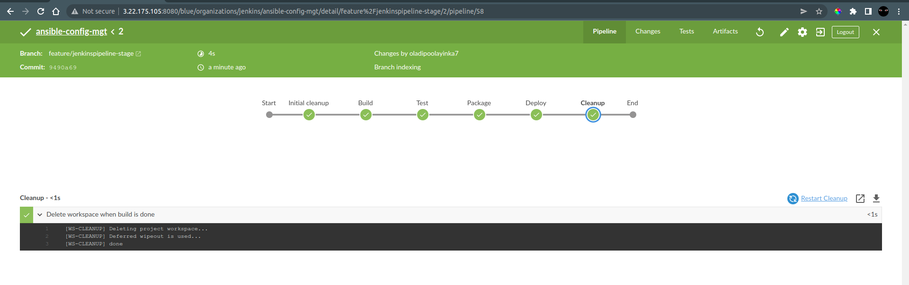

# Experience Continuous Integration With Jenkins, Ansible, Artifactory, Sonarqube and PHP


## Ansible Roles for CI Environment

### Configure Ansible for Jenkins Deployment

 - Navigate to Jenkins URL
 - Install Blue Oceans Jenkins Plugin
 - Create a new Pipeline
 - Connect to Github using a Personal Access Token
 - Create a new pipeline with the ansible repository
 - Add a new directory *deploy* to the ansible repository and create a __Jenkinsfile__ in the directory
```groovy
pipeline {
    agent any
	 
	stages {
		stage('Build') {
			steps {
				script {
					 sh 'echo "Building Stage"'
				}
			}
		}
	}
}
```
 - Configure the new pipeline with the script path as the path to the __Jenkinsfile__

  > Go to the pipeline > Configure > Build Configuration > Script Path

 - Build the project and view it in Blue Oceans


 - Add Test stage to the Jenkinsfile

```groovy
stage('Test') {
	steps {
		script {
				sh 'echo "Testing Stage"'
		}
	}
}
```

 - Build the project


## Quick Task

 - Add Package, Deploy and Clean Up stages to the Jenkinsfile

```groovy
// FIrst stage
stage('Initial cleanup') {
	steps {
		dir("${WORKSPACE}") {
			deleteDir()
		}
	}
}

// After the Test Stage
stage('Package') {
	steps {
		script {
			sh 'echo "Packaging Stage"'
		}
	}
}

stage('Deploy') {
	steps {
		script {
			sh 'echo "Deployment Stage"'
		}
	}
}

stage('Cleanup') {
	steps {
		cleanWs()
	}
}
```

 - Build the project



## Running Ansible from Jenkins

### Install Ansible on the Jenkins server
 - Install Ansible

```bash
sudo yum install ansible -y

ansible --version
```
 - Install Ansible plugin in Jenkins
 - To connect Ansible to Jenkins
  > Go to Manage Jenkins > Global Tool Configuration > Ansible 
 - Create a new Ansible installation and add the path to ansible
> NOTE: Add only the directory URL
 - Delete the content of the Jenkinsfile and add the pipeline below
```groovy
pipeline {
	agent	any

	environment {
		ANSIBLE_CONFIG="${WORKSPACE}/deploy/ansible.cfg"
	}

	stages {
		
		stage('Initial cleanup') {
			steps {
				dir("${WORKSPACE}") {
					deleteDir()
				}
			}
		}

		stage('Checkout SCM') {
			steps {
				git branch: 'main', url: 'https://github.com/Horleryheancarh/ansible-config-mgt.git'
			}
		}

		stage('Prepare Ansible For Execution') {
			steps {
				script {
					sh 'echo "${WORKSPACE}"'
					sh 'sed -i "3 a roles_path=${WORKSPACE}/roles" ${ANSIBLE_CONFIG}'
					sh 'cat ${ANSIBLE_CONFIG}'
				}
			}
		}

		stage('Run Ansible playbook') {
			steps {
				ansiblePlaybook become: true, colorized: true, credentialsId: 'private-key', disableHostKeyChecking: true, installation: 'ansible', inventory: 'inventory/dev.yml', playbook: 'playbooks/site.yml'
			}
		}

		stage('Cleanup') {
			steps {
				cleanWs(cleanWhenAborted: true, cleanWhenFailure: true, cleanWhenNotBuilt: true, cleanWhenUnstable: true, deleteDirs: true)
			}
		}

	}
}
```

 - Build the project


### Parameterizing Jenkinsfile for Ansible Deployment
 - Add the code below to Jenkinsfile before the stages block
```groovy
parameters { string(name: 'inventory', defaultValue: 'dev',  description: 'This is the inventory file for the environment to deploy configuration') }
```
 - Build the project and select another environment to run the playbook against


## Plot Setup

 - Install Plot Plugin


 - Install dependencies for plot
```bash
# Install PHP
sudo yum module reset php -y

sudo yum module enable php:remi-7.4 -y

sudo yum install -y php  php-common php-mbstring php-opcache php-intl php-xml php-gd php-curl php-mysqlnd php-fpm php-json

sudo systemctl start php-fpm

sudo systemctl enable php-fpm

# Install Composer
curl -sS https://getcomposer.org/installer | php

sudo mv composer.phar /usr/bin/composer

composer --version
```
 - Add Plot to the Jenkinsfile

```groovy
stage('Prepare Dependencies') {
	steps {
		sh 'mv .env.sample .env'
		sh 'composer install'
		sh 'php artisan migrate'
		sh 'php artisan db:seed'
		sh 'php artisan key:generate'
	}
}

stage('Execute Unit Tests') {
	steps {
		sh './vendor/bin/phpunit'
	}
}

stage('Code Analysis') {
	steps {
		sh 'phploc app/ --log-csv build/logs/phploc.csv'
	}
}

stage('Plot Code Coverage Report') {
	steps {
		plot csvFileName: 'plot-396c4a6b-b573-41e5-85d8-73613b2ffffb.csv', csvSeries: [[displayTableFlag: false, exclusionValues: 'Lines of Code (LOC),Comment Lines of Code (CLOC),Non-Comment Lines of Code (NCLOC),Logical Lines of Code (LLOC)                          ', file: 'build/logs/phploc.csv', inclusionFlag: 'INCLUDE_BY_STRING', url: '']], group: 'phploc', numBuilds: '100', style: 'line', title: 'A - Lines of code', yaxis: 'Lines of Code'
		plot csvFileName: 'plot-396c4a6b-b573-41e5-85d8-73613b2ffffb.csv', csvSeries: [[displayTableFlag: false, exclusionValues: 'Directories,Files,Namespaces', file: 'build/logs/phploc.csv', inclusionFlag: 'INCLUDE_BY_STRING', url: '']], group: 'phploc', numBuilds: '100', style: 'line', title: 'B - Structures Containers', yaxis: 'Count'
		plot csvFileName: 'plot-396c4a6b-b573-41e5-85d8-73613b2ffffb.csv', csvSeries: [[displayTableFlag: false, exclusionValues: 'Average Class Length (LLOC),Average Method Length (LLOC),Average Function Length (LLOC)', file: 'build/logs/phploc.csv', inclusionFlag: 'INCLUDE_BY_STRING', url: '']], group: 'phploc', numBuilds: '100', style: 'line', title: 'C - Average Length', yaxis: 'Average Lines of Code'
		plot csvFileName: 'plot-396c4a6b-b573-41e5-85d8-73613b2ffffb.csv', csvSeries: [[displayTableFlag: false, exclusionValues: 'Cyclomatic Complexity / Lines of Code,Cyclomatic Complexity / Number of Methods ', file: 'build/logs/phploc.csv', inclusionFlag: 'INCLUDE_BY_STRING', url: '']], group: 'phploc', numBuilds: '100', style: 'line', title: 'D - Relative Cyclomatic Complexity', yaxis: 'Cyclomatic Complexity by Structure'      
		plot csvFileName: 'plot-396c4a6b-b573-41e5-85d8-73613b2ffffb.csv', csvSeries: [[displayTableFlag: false, exclusionValues: 'Classes,Abstract Classes,Concrete Classes', file: 'build/logs/phploc.csv', inclusionFlag: 'INCLUDE_BY_STRING', url: '']], group: 'phploc', numBuilds: '100', style: 'line', title: 'E - Types of Classes', yaxis: 'Count'
		plot csvFileName: 'plot-396c4a6b-b573-41e5-85d8-73613b2ffffb.csv', csvSeries: [[displayTableFlag: false, exclusionValues: 'Methods,Non-Static Methods,Static Methods,Public Methods,Non-Public Methods', file: 'build/logs/phploc.csv', inclusionFlag: 'INCLUDE_BY_STRING', url: '']], group: 'phploc', numBuilds: '100', style: 'line', title: 'F - Types of Methods', yaxis: 'Count'
		plot csvFileName: 'plot-396c4a6b-b573-41e5-85d8-73613b2ffffb.csv', csvSeries: [[displayTableFlag: false, exclusionValues: 'Constants,Global Constants,Class Constants', file: 'build/logs/phploc.csv', inclusionFlag: 'INCLUDE_BY_STRING', url: '']], group: 'phploc', numBuilds: '100', style: 'line', title: 'G - Types of Constants', yaxis: 'Count'
		plot csvFileName: 'plot-396c4a6b-b573-41e5-85d8-73613b2ffffb.csv', csvSeries: [[displayTableFlag: false, exclusionValues: 'Test Classes,Test Methods', file: 'build/logs/phploc.csv', inclusionFlag: 'INCLUDE_BY_STRING', url: '']], group: 'phploc', numBuilds: '100', style: 'line', title: 'I - Testing', yaxis: 'Count'
		plot csvFileName: 'plot-396c4a6b-b573-41e5-85d8-73613b2ffffb.csv', csvSeries: [[displayTableFlag: false, exclusionValues: 'Logical Lines of Code (LLOC),Classes Length (LLOC),Functions Length (LLOC),LLOC outside functions or classes ', file: 'build/logs/phploc.csv', inclusionFlag: 'INCLUDE_BY_STRING', url: '']], group: 'phploc', numBuilds: '100', style: 'line', title: 'AB - Code Structure by Logical Lines of Code', yaxis: 'Logical Lines of Code'
		plot csvFileName: 'plot-396c4a6b-b573-41e5-85d8-73613b2ffffb.csv', csvSeries: [[displayTableFlag: false, exclusionValues: 'Functions,Named Functions,Anonymous Functions', file: 'build/logs/phploc.csv', inclusionFlag: 'INCLUDE_BY_STRING', url: '']], group: 'phploc', numBuilds: '100', style: 'line', title: 'H - Types of Functions', yaxis: 'Count'
		plot csvFileName: 'plot-396c4a6b-b573-41e5-85d8-73613b2ffffb.csv', csvSeries: [[displayTableFlag: false, exclusionValues: 'Interfaces,Traits,Classes,Methods,Functions,Constants', file: 'build/logs/phploc.csv', inclusionFlag: 'INCLUDE_BY_STRING', url: '']], group: 'phploc', numBuilds: '100', style: 'line', title: 'BB - Structure Objects', yaxis: 'Count'
	}
}
```
 - Run the playbook


## Artifactory Setup
 - Create a t2-medium instance for artifactory
 - Install Java and Artifactory
```yml
- name: install java 11
  yum:
    name: java-11-openjdk-devel
    state: present

- name: install java 11
  yum:
    name: 
      - wget
      - unzip
    state: present

- name: Configuring java path
  template:
    src: templates/bash-profile.j2
    dest: .bash_profile
  

- name: reload the /etc/profile
  shell: source ~/.bash_profile


- name: add the repository key to repos list
  get_url:
    url:  https://releases.jfrog.io/artifactory/artifactory-rpms/artifactory-rpms.repo 
    dest: /home/ec2-user/jfrog-artifactory-rpms.repo
    mode: '0755'
 
- name: Copy the downloaded file to the etc repo
  copy:
    src: /home/ec2-user/jfrog-artifactory-rpms.repo
    dest: /etc/yum.repos.d/jfrog-artifactory-rpms.repo
    remote_src: yes
    follow: yes

- name: update cache
  yum:
    update_cache: yes

- name: install artifactory
  yum:
    name: jfrog-artifactory-oss
    state: present

- name: start and enable artifactory
  service:
    name: artifactory
    state: started
    enabled: yes
```


 - Install Artifactory plugin in Jenkins


 - Add artifactory stages to package and upload to artifactory
```groovy
stage ('Package Artifact') {
	steps {
		sh 'zip -qr php-todo.zip ${WORKSPACE}/*'
	}
}

stage ('Upload Artifact to Artifactory') {
	steps {
		script { 
			def server = Artifactory.server 'artifactory-server'                 
			def uploadSpec = """{
				"files": [
					{
						"pattern": "php-todo.zip",
						"target": "PBL/php-todo",
						"props": "type=zip;status=ready"
					}
				]
			}""" 

			server.upload spec: uploadSpec
		}
	}
}
```
 - Create a repository on artifactory 


 - Configure artifactory server on jenkins


 - Create database and user for Artifactory


 - Run the playbook


## Sonarqube Setup

 - Installing SonarQube with an ansible role
```yml
---
# tasks file for sonarqube
- name: set max_map
  become: true
  command: sysctl -w vm.max_map_count=262144

- name: set file max
  become: true
  command: sysctl -w fs.file-max=65536

- name: Add max limits
  lineinfile:
    path: /etc/security/limits.conf
    line: 
      - sonarqube   -   nofile   65536
      - sonarqube   -   nproc    4096
    create: yes

- name: Add ppa  repository 
  apt_repository:
    repo: ppa:linuxuprising/java

- name: install python3
  apt:
    name: 
      - python3
      - python3-pip
      - python3-dev
      - libpq-dev
    state: present

- name: Install setuptools
  pip:
    name: setuptools
    extra_args: --upgrade

- name: upgrade pip command
  pip:
    name: pip
    extra_args: --upgrade

- name: install pip dependencies
  pip:
    name:  psycopg2
    executable: pip3

- name: install java 11
  apt:
    name: 
      - openjdk-11-jdk
      - openjdk-11-jre
    state: present
    allow_unauthenticated: yes

- import_tasks: postgresql.yml

- name: Ensure group sonar exists
  group:
    name: sonar
    state: present

- import_tasks: sonarqube-setup.yml

- name: start and enable sonarqube
  service:
    name: sonar
    state: started
    enabled: yes
```


 - Install Sonarqube plugin on Jenkins


 - Configure Sonarqube on Jenkins


 - Add stage in Jenkinsfile for Sonar Quality Gate
```groovy
stage('SonarQube Quality Gate') {
	when { branch pattern: "^develop*|^hotfix*|^release*|^main*", comparator: "REGEXP" }
		environment {
			scannerHome = tool 'SonarQubeScanner'
		}
		steps {
			withSonarQubeEnv('sonarqube') {
				sh "${scannerHome}/bin/sonar-scanner -Dproject.settings=sonar-project.properties"
			}
			timeout(time: 1, unit: 'MINUTES') {
				waitForQualityGate abortPipeline: true
			}
		}
}
```

 - Run playbook to test Sonarqube


## Tasks

 - Create two EC2 instances to serve as Jenkins Slaves (NODES)


 - Configure webhook between Jenkins and Github


 - Deploy the application to all eenvironment


 <!-- - Experience Pentesting -->


[Video Demonstration](https://drive.google.com/file/d/1EfKS9FFf2Lgu2Vp3Aikw3nUyabRZdZ3I/view?usp=sharing)
