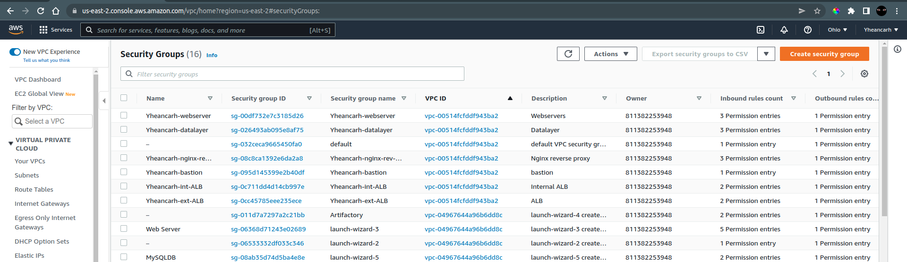
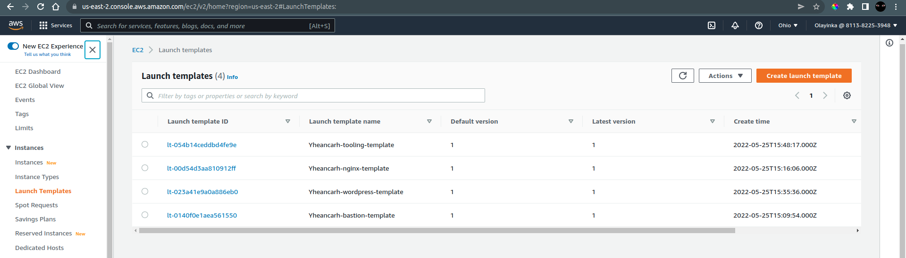

#	AWS Cloud Solution For 2 Company Websites Using A Reverse Proxy Technology

##	Set Up Architecture


##	Create an Organization Unit in AWS and add a user


- Create VPC


- Create the Public and Private Subnets


- Create Routing table for the private and public subnets


- Create an Internet Gateway and associate it with the public subnet


- Create a NAT gateway


- Create security groups for the nginx server, bastion server, webservers, application load balancers and data layer



- Create EC2 instances for nginx, bastion and webservers
- Configure the instances
```bash
# For Bastion
sudo yum install -y https://dl.fedoraproject.org/pub/epel/epel-release-latest-8.noarch.rpm
sudo yum install -y dnf-utils http://rpms.remirepo.net/enterprise/remi-release-8.rpm
sudo yum install wget vim python3 telnet htop git mysql net-tools chrony -y
sudo systemctl start chronyd
sudo systemctl enable chronyd
```

```bash
# For Nginx and Webserver
sudo yum install -y https://dl.fedoraproject.org/pub/epel/epel-release-latest-8.noarch.rpm
sudo yum install -y dnf-utils http://rpms.remirepo.net/enterprise/remi-release-8.rpm
sudo yum install wget vim python3 telnet htop git mysql net-tools chrony -y
sudo systemctl start chronyd
sudo systemctl enable chronyd

# Configure selinux policies
sudo setsebool -P httpd_can_network_connect=1
sudo setsebool -P httpd_can_network_connect_db=1
sudo setsebool -P httpd_execmem=1
sudo setsebool -P httpd_use_nfs=1

# Install Amazon EFS utils for mounting EFS
git clone https://github.com/aws/efs-utils
cd efs-utils
sudo yum install -y make rpm-build
make rpm
sudo yum install -y  ./build/amazon-efs-utils*rpm

# Self-signed Certificate for Nginx
sudo mkdir /etc/ssl/private
sudo chmod 700 /etc/ssl/private
openssl req -x509 -nodes -days 365 -newkey rsa:2048 -keyout /etc/ssl/private/Yheancarh.key -out /etc/ssl/certs/Yheancarh.crt
sudo openssl dhparam -out /etc/ssl/certs/dhparam.pem 2048

# Self-signed Certificate for Apache
sudo yum install -y mod_ssl
openssl req -newkey rsa:2048 -nodes -keyout /etc/pki/tls/private/Yheancarh.key -x509 -days 365 -out /etc/pki/tls/certs/Yheancarh.crt
vi /etc/httpd/conf.d/ssl.conf
```
- Create AMIs from the instances


- Create Certificate using the Amazon Certificate Manager


- Create KMS key


- Create RDS instance using the KMS key


- Create Application Load Balancers (one internal and one external)


- Create EFS


- Create two access points on EFS


- Create Launch Templates from the AMIs

#### ADD USERDATA to the configuration to setup the templates
```bash
##### bastion userdata
#!/bin/bash
yum install -y mysql
yum install -y git tmux
yum install -y ansible

##### nginx userdata 
#!/bin/bash
yum install -y nginx
systemctl start nginx
systemctl enable nginx
git clone https://github.com/Horleryheancarh/ACS-project-config.git
mv /ACS-project-config/reverse.conf /etc/nginx/
mv /etc/nginx/nginx.conf /etc/nginx/nginx.conf-distro
cd /etc/nginx/
touch nginx.conf
sed -n 'w nginx.conf' reverse.conf
systemctl restart nginx
rm -rf reverse.conf
rm -rf /ACS-project-config

##### tooling userdata
#!/bin/bash
mkdir /var/www/
sudo mount -t efs -o tls fs-0a2843c35162b3582:/ /var/www/
yum install -y httpd 
systemctl start httpd
systemctl enable httpd
yum module reset php -y
yum module enable php:remi-7.4 -y
yum install -y php php-common php-mbstring php-opcache php-intl php-xml php-gd php-curl php-mysqlnd php-fpm php-json
systemctl start php-fpm
systemctl enable php-fpm
git clone https://github.com/Horleryheancarh/tooling.git
mkdir /var/www/html
cp -R /tooling-1/html/*  /var/www/html/
cd /tooling-1
mysql -h acs-database.cdqpbjkethv0.us-east-1.rds.amazonaws.com -u ACSadmin -p toolingdb < tooling-db.sql
cd /var/www/html/
touch healthstatus
sed -i "s/$db = mysqli_connect('mysql.tooling.svc.cluster.local', 'admin', 'admin', 'tooling');/$db = mysqli_connect('yheancarh-database.cvqm1hu6ijyh.us-east-2.rds.amazonaws.com', 'Yheancarhadmin', 'admin12345', 'toolingdb');/g" functions.php
chcon -t httpd_sys_rw_content_t /var/www/html/ -R
systemctl restart httpd

##### wordpress userdata
#!/bin/bash
mkdir /var/www/
sudo mount -t efs -o tls,accesspoint=fsap-0ef26431e2c3bf8da fs-0a2843c35162b3582:/ /var/www/
yum install -y httpd 
systemctl start httpd
systemctl enable httpd
yum module reset php -y
yum module enable php:remi-7.4 -y
yum install -y php php-common php-mbstring php-opcache php-intl php-xml php-gd php-curl php-mysqlnd php-fpm php-json
systemctl start php-fpm
systemctl enable php-fpm
wget http://wordpress.org/latest.tar.gz
tar xzvf latest.tar.gz
rm -rf latest.tar.gz
cp wordpress/wp-config-sample.php wordpress/wp-config.php
mkdir /var/www/html/
cp -R /wordpress/* /var/www/html/
cd /var/www/html/
touch healthstatus
sed -i "s/localhost/yheancarh-database.cvqm1hu6ijyh.us-east-2.rds.amazonaws.com/g" wp-config.php 
sed -i "s/username_here/Yheancarhadmin/g" wp-config.php 
sed -i "s/password_here/admin12345/g" wp-config.php 
sed -i "s/database_name_here/wordpressdb/g" wp-config.php 
chcon -t httpd_sys_rw_content_t /var/www/html/ -R
systemctl restart httpd
```



- Create Databases in RDS instance


- Create new Records on Route53 pointing to the external ALB


- Create AutoScaling Groups


- Check status of target groups


- Check EC2 Instances


- Final Wordpress Page


