# AUTOMATE INFRASTRUCTURE WITH IAC USING TERRAFORM PART 1


## Setup Workspace

- Create S3 bucket

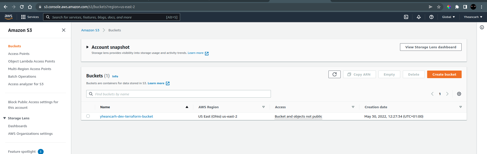

- Install and configure AWS CLI

```bash
# On Ubuntu

sudo apt install awscli

```

- Install Python SDK (boto3)

```bash

pip install boto3

```

- Access the bucket using AWS CLI

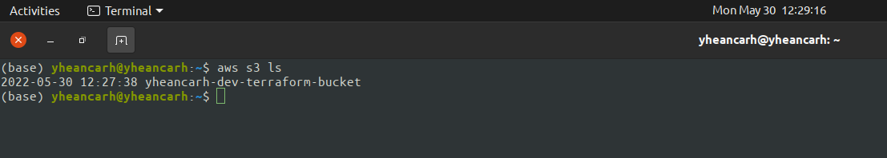

- Access the bucket using boto3

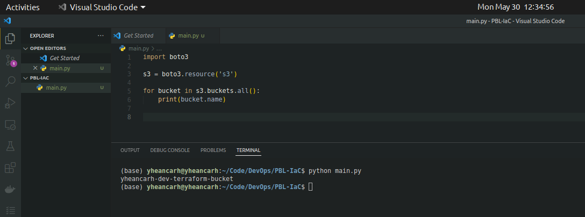


## Create VPC and Subnets

- Create a directory and a file named main.tf in the directory
- Write the Provider and resources section

```HCL
provider "aws" {
	region = "us-east-2"
}

resource "aws_vpc" "main" {
	cidr_block						= "172.16.0.0/16"
	enable_dns_support				= "true"
	enable_dns_hostname				= "true"
	enable_classiclink				= "false"
	enable_classiclink_dns_support	= "false"
}
```


- Run ```terraform init```

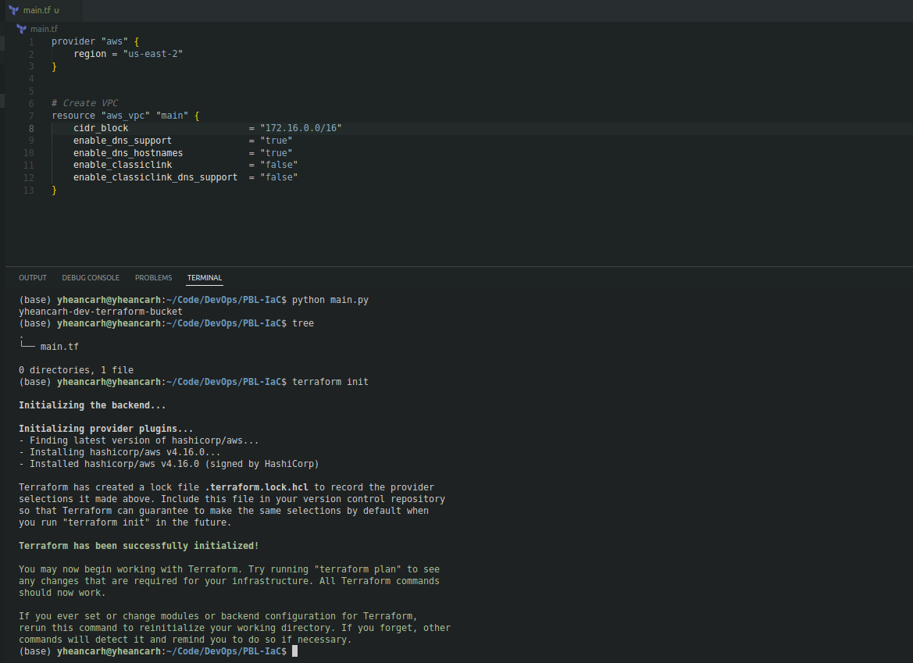

- Run ```terraform plan```

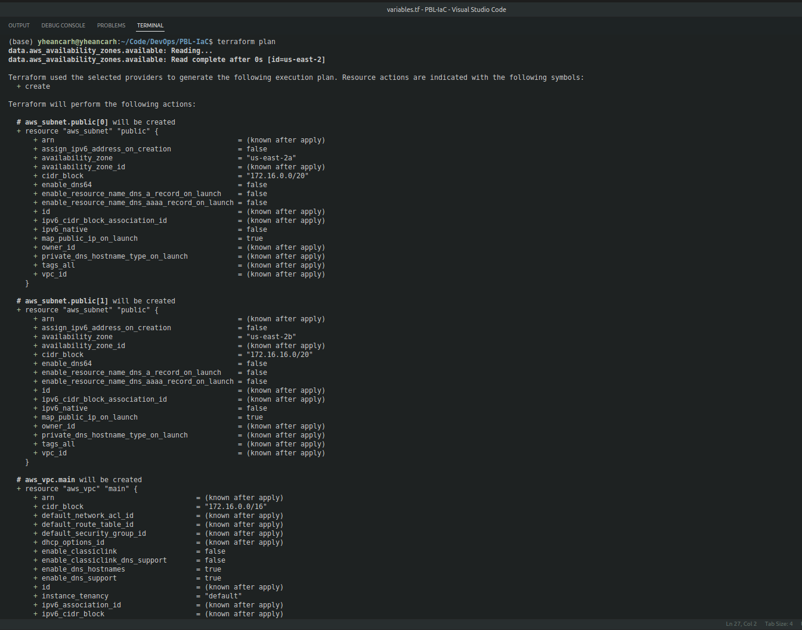

- Run ```terraform apply```

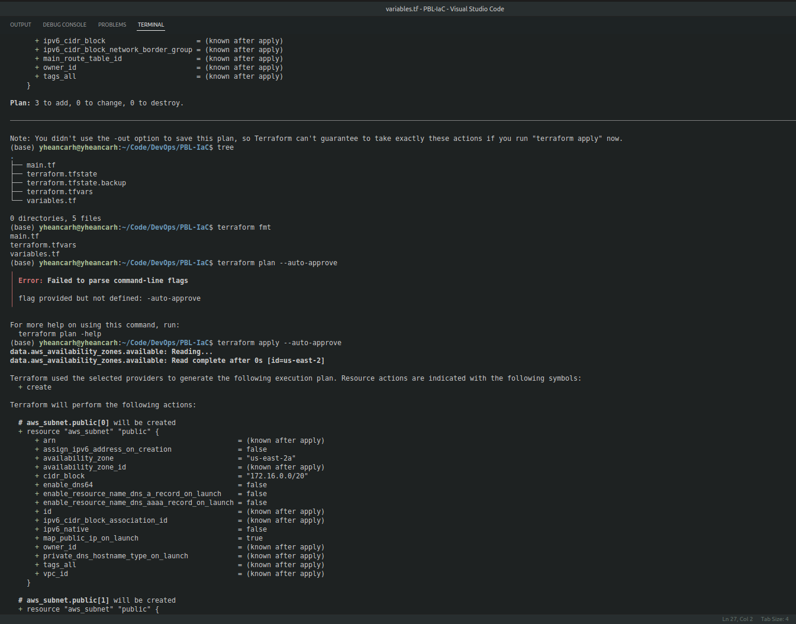
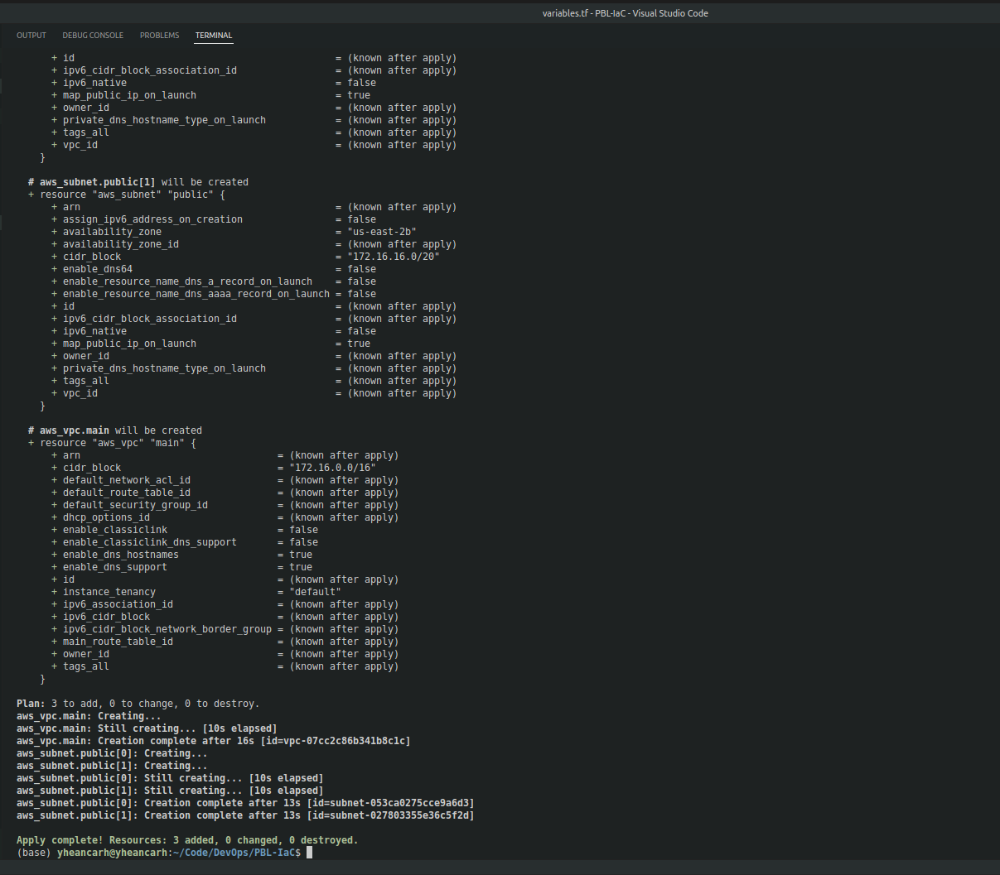
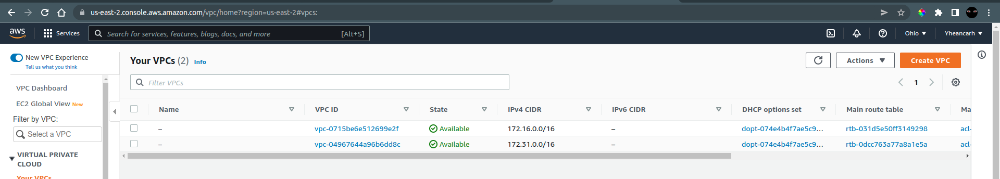
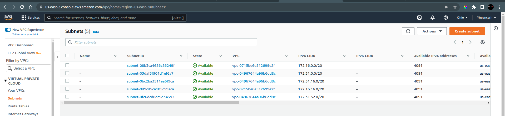

- Run ```terraform destroy```

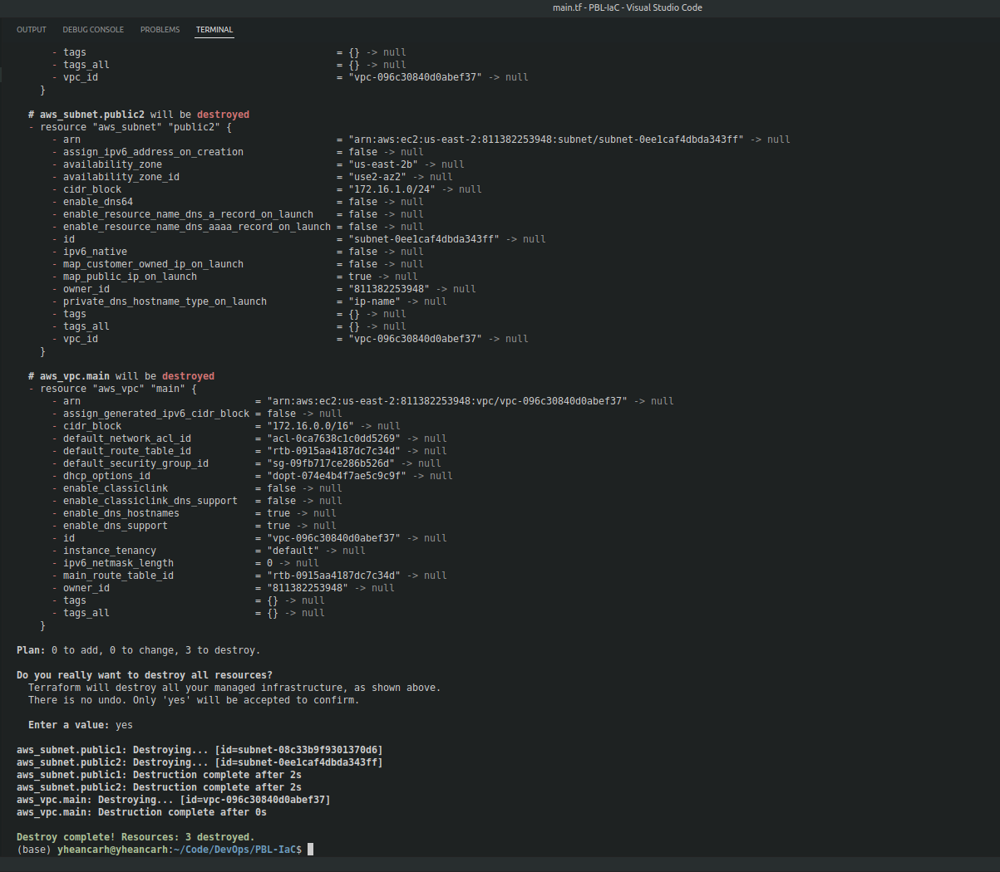
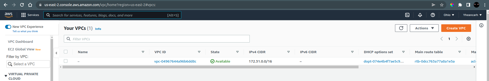
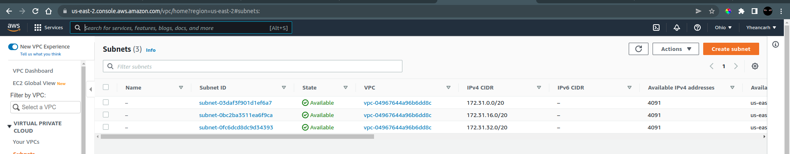


## Refacor the Code

To refactor the code you have to 
- Fix Hard coded values
- Fix multiple resource blocks
- Make the cidr_block dynamic
- Introduce ```variables.tf``` and ```terraform.tfvars```

__The final code repo is available [here](https://github.com/Horleryheancarh/PBL-IaC)__

