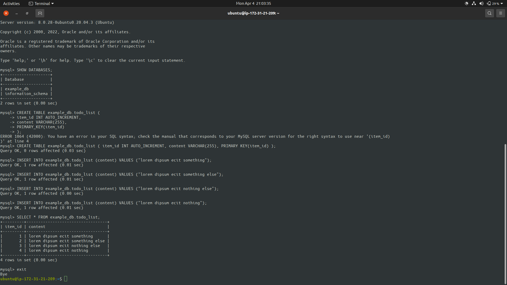

# LEMP STACK IMPLEMENTATION

## STEP 0

### Create and Launch an EC2 instance


## STEP 1

### Installing NGINX server
```bash
	sudo apt update

	sudo apt install nginx

	# Verify nginx is installed
	sudo systemctl status nginx

	# Get nginx default webpage
	curl http://localhost:80
```


### NGINX on Instance URL
> Visit http://\<Public-IP-Address\>:80


## STEP 2

### Installing MySQL
```bash
	sudo apt install mysql-server

	# Setup
	sudo mysql_secure_installation

	sudo mysql
```

### Populate the Database


## STEP 3

### Installing PHP
```bash
	sudo apt install php-fpm php-mysql
```

## STEP 4

### Configure NGINX to use PHP processor
```bash
	sudo mkdir /var/www/projectlemp

	sudo chown -R ubuntu:ubuntu /var/www/projectlemp

	# New config file in nginx's sites-available
	sudo vim /etc/nginx/sites-available/projectlemp
```

#### Contents of config file
```yml
	#/etc/nginx/sites-available/projectlemp

	server {
		listen 80;
		server_name projectlemp www.projectlemp;
		root /var/www/projectlemp;

		index index.html index.htm index.php;

		location / {
			try_files $uri $uri/ =404;
		}

		location ~ \.php$ {
			include snippets/fastcgi-php.conf;
			fastcgi_pass unix:/var/run/php/php7.4-fpm.sock;
		}

		location ~ /\.ht {
			deny all;
		}

	}
```


```bash
	sudo ln -s /etc/nginx/sites-available/projectlemp /etc/nginx/sites-enabled/

	# Test config file for syntax errors
	sudo nginx -t

	# Disable nginx default host
	sudo unlink /etc/nginx/sites-enabled/default

	# Restart nginx
	sudo systemctl reload nginx

	# Create index.html file in the /var/www/projectlemp directory
	sudo echo 'Hello LEMP from hostname' $(curl -s http://169.254.169.254/latest/meta-data/public-hostname) 'with public IP' $(curl -s http://169.254.169.254/latest/meta-data/public-ipv4) > /var/www/projectlemp/index.html
```


> Visiting the public URL page
> http://\<Public-IP-Address\>:80


## STEP 5

### Testing PHP with NGINX

```bash
	sudo vim /var/www/projectlemp/info.php
```

#### Content of info.php

```php
	<?php
	phpinfo();
```

> Visit the URL
> http://`server_IP`/info.php


## STEP 6

### REtrieving data from MySQL database with PHP

```bash
	# Connect to MySQL
	sudo mysql

	# create database
	mysql> CREATE DATABASE `example_db`;

	# create user
	mysql> CREATE USER 'testuser'@'%' IDENTIFIED WITH mysql_native_password BY 'password';

	# grant access
	mysql> GRANT ALL ON example_db.* TO 'testuser'@'%';

	# exit mysql
	mysql> exit

	# log into mysql as testuser
	mysql -u testuser -p

	mysql> SHOW DATABASES;

	# Create and populate table as shown in the screenshot below
```


### Connect to MySQL and and query for the content of todo_list

```bash
	vim /var/www/projectlemp/todo_list.php
```

```php
<?php
	$user = "example_user";
	$password = "password";
	$database = "example_database";
	$table = "todo_list";

	try {
		$db = new PDO("mysql:host=localhost;dbname=$database", $user, $password);
		echo "<h2>TODO</h2><ol>";
		foreach($db->query("SELECT content FROM $table") as $row) {
			echo "<li>" . $row['content'] . "</li>";
		}
		echo "</ol>";
	} catch (PDOException $e) {
		print "Error!: " . $e->getMessage() . "<br/>";
		die();
	}
```

> Visit the URL http://`server_IP`/todo_list.php


