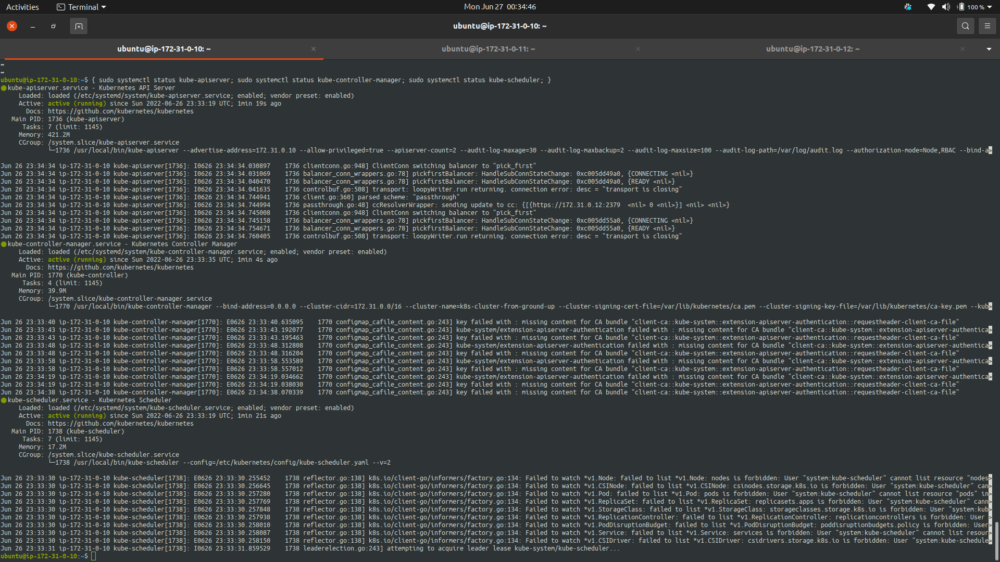
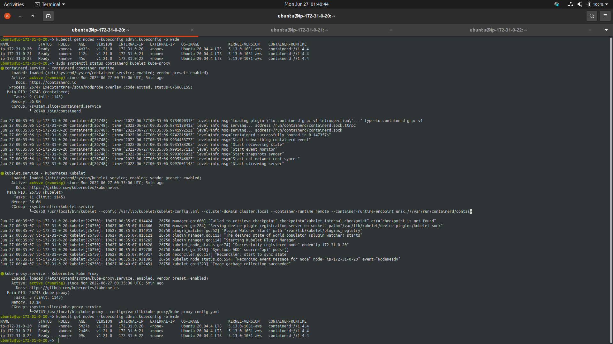

# Orchestrating containers across multiple Virtual Servers with Kubernetes

## Setup the Network Infrastructure for the Project


> Details 3 master nodes and 3 worker nodes in the same cluster and subnet

## Install AWSCLI, KUBECTL, CFSSL and CFSSLJSON
```bash

wget https://storage.googleapis.com/kubernetes-release/release/v1.21.0/bin/linux/amd64/kubectl
chmod +x kubectl
sudo mv kubectl /usr/local/bin/

kubectl version --client

wget -q --show-progress --https-only --timestamping \ 
	https://storage.googleapis.com/kubernetes-the-hard-way/cfssl/1.4.1/linux/cfssl \
	https://storage.googleapis.com/kubernetes-the-hard-way/cfssl/1.4.1/linux/cfssljson
chmod +x cfssl cfssljson
sudo mv cfssl cfssljson /usr/local/bin/

```

## AWS RESOURCES
- Single VPC
- SUBNET
- SECURITY GROUP
- LOAD BALANCER
- TARGET GROUP for the master nodes
- 3 master nodes
- 3 worker nodes

## Create TLS certificates for
- kube-scheduler
- kube-controller-manager
- etcd
- kube-apiserver
- kubelet
- kube-proxy

## Distrbute the certificates to the respective instances
## Create Kubernetes Configuration files using kubectl
## Setup encryption using etcd
## Bootsrap the control plane

## Test the master nodes




## Configure the Worker Nodes

## Test the Worker Nodes



ALL CONFIGURATION COMMANDS ARE CONTAINED IN [file.](PBL-21/configfile.sh)