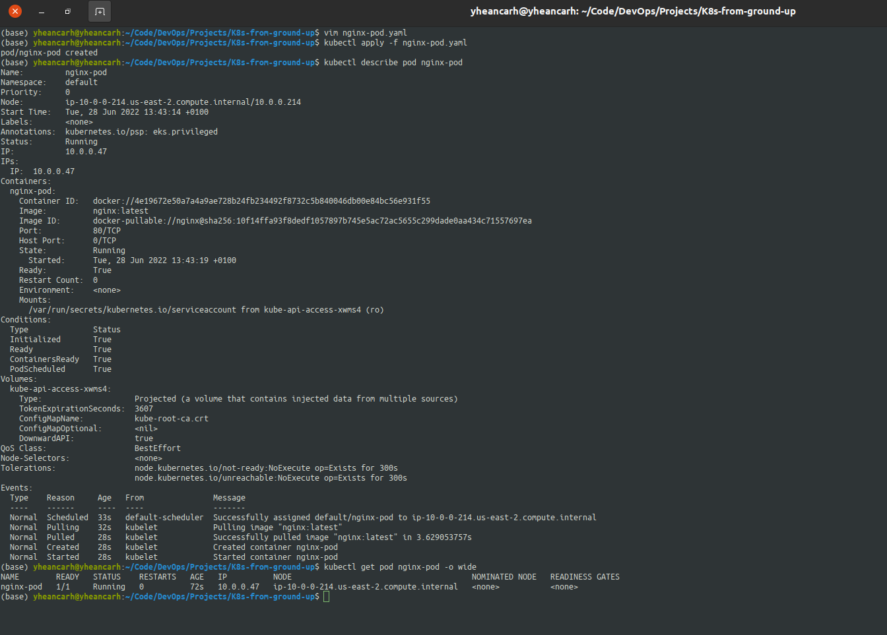
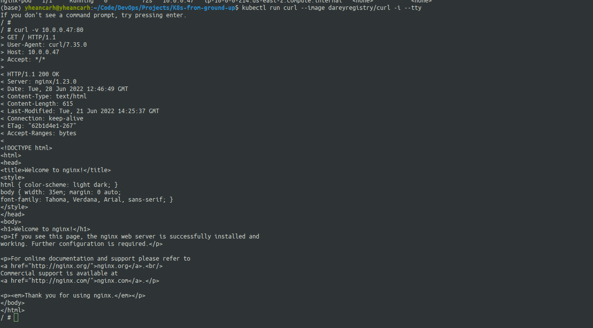
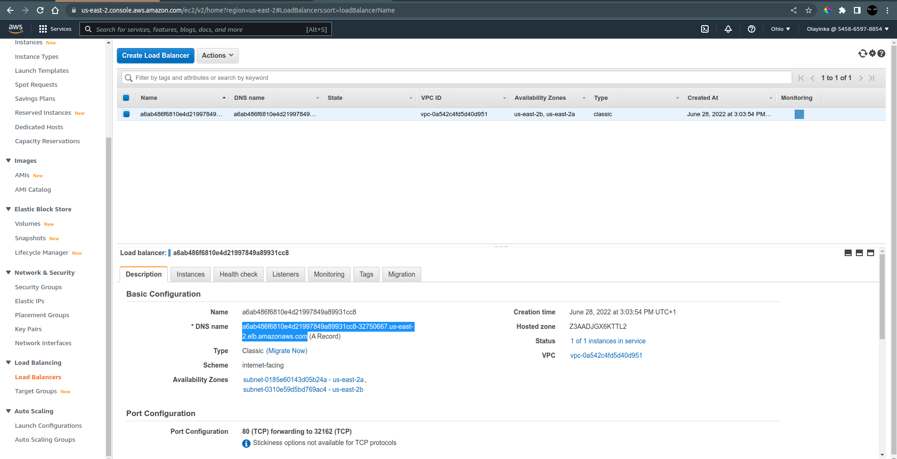
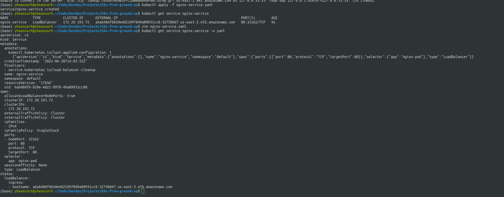
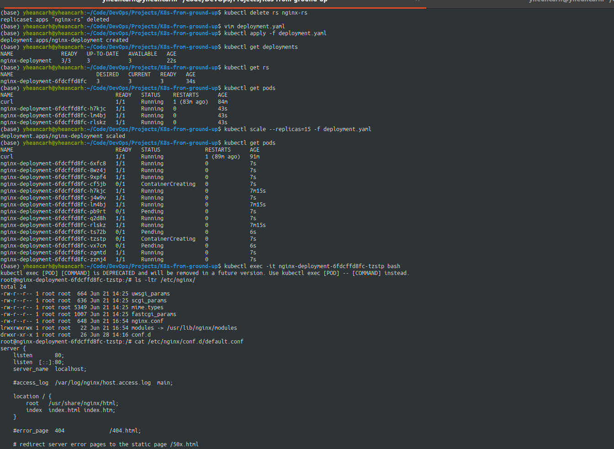
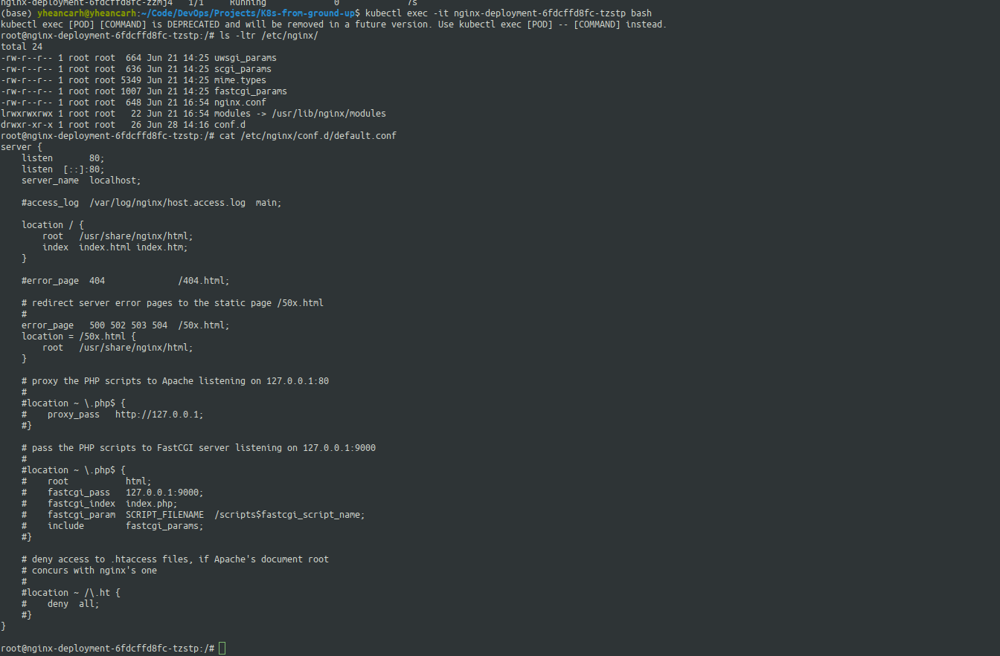
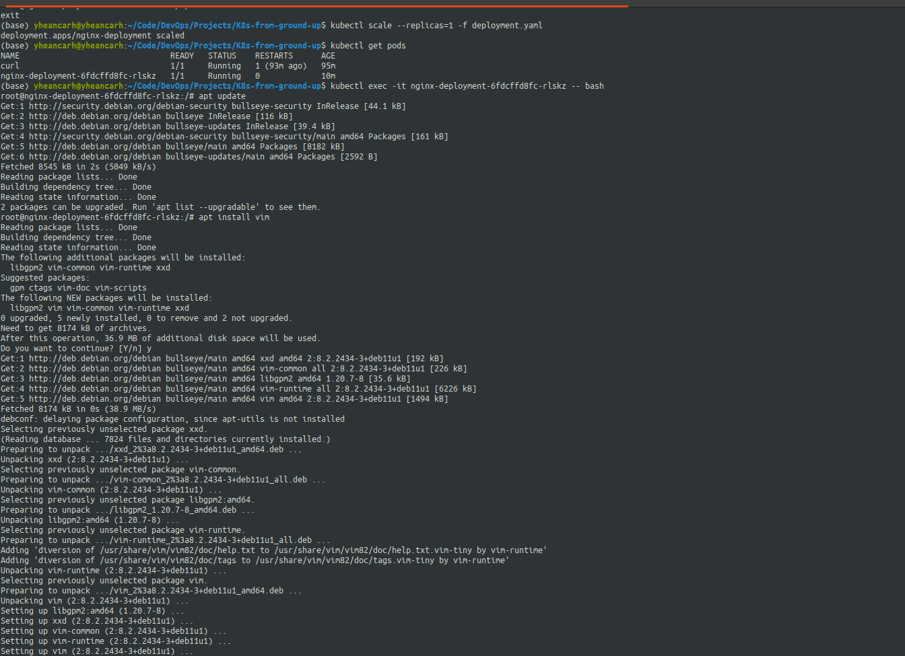
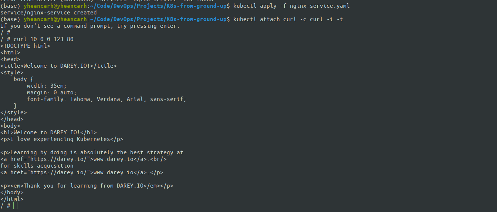

# Deploying Applications Into Kubernetes Cluster

- Create a Pod manifest file ```nginx-pod.yaml```
```yaml
apiVersion: v1
kind: Pod
metadata:
  name: nginx-pod
spec:
  containers:
    - image: nginx:latest
      name: nginx-pod
      ports:
        - containerPort: 80
          protocol: TCP
```

- Run the file

```bash
kubectl apply -f nginx-pod.yaml

# Get detail about the pod
kubectl describe pod nginx-pod

# Get the pod
kubectl get pod nginx-pod -o wide
```



- Connect to the pod

```bash
kubectl run curl --image=dareyregistry/curl -i -tty

curl -v 10.0.0.47:80
```




- Create a service manifest file ```nginx-service.yaml```

```yaml
apiVersion: v1
kind: Service
metadata:
  name: nginx-service
spec:
  selector:
    app: nginx-pod 
  ports:
    - protocol: TCP
      port: 80
      targetPort: 80
```

```bash
# Run the file
kubectl apply -f nginx-service.yaml
```
- Create a Replicaset

```yaml
apiVersion: apps/v1
kind: ReplicaSet
metadata:
  name: nginx-rs
spec:
  replicas: 3
  selector:
    app: nginx-pod
  template:
    metadata:
      name: nginx-pod
      labels:
         app: nginx-pod
    spec:
      containers:
      - image: nginx:latest
        name: nginx-pod
        ports:
        - containerPort: 80
          protocol: TCP
```

```bash
# Run the file
kubectl apply -f rs.yaml
```

- Delete the nginx-pod and get the remaining pods

```bash
kubectl delete pod nginx-pod

kubectl get pods
```


## Using AWS load balancer to access the service in kubernetes

- Update the service to use a load balancer

```yaml
apiVersion: v1
kind: Service
metadata:
  name: nginx-service
spec:
  type: LoadBalancer
  selector:
    tier: frontend
  ports:
    - protocol: TCP
      port: 80
      targetPort: 80
```






- Delete the Replica Set

```bash
kubectl delete rs nginx-rs
```

- Create a deployment manifest file ```deployment.yaml```

```yaml
apiVersion: apps/v1
kind: Deployment
metadata:
  name: nginx-deployment
  labels:
    tier: frontend
spec:
  replicas: 3
  selector:
    matchLabels:
      tier: frontend
  template:
    metadata:
      labels:
        tier: frontend
    spec:
      containers:
      - name: nginx
        image: nginx:latest
        ports:
        - containerPort: 80
```


- Check the content of the default nginx configuration



- Install __vim__ and edit the default nginx page

```bash
apt update

apt install vim

vim /usr/share/nginx/html/index.html
```






