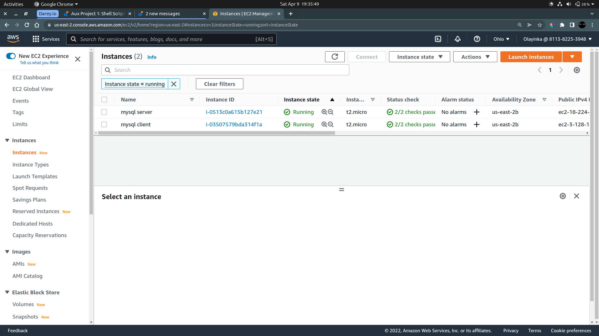
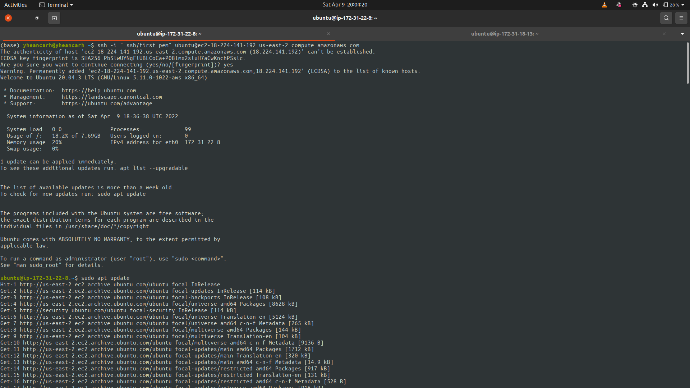
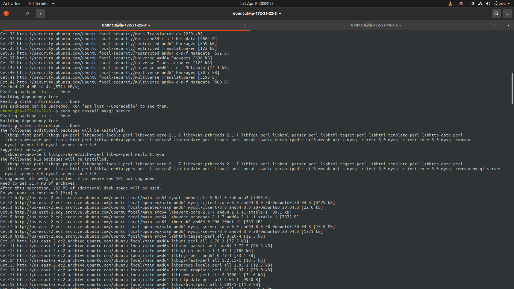
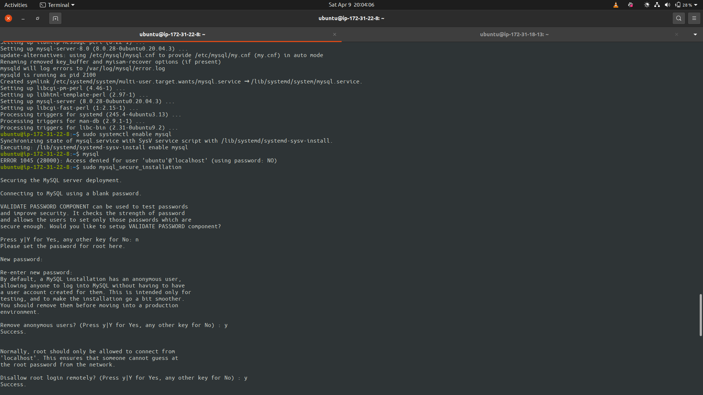
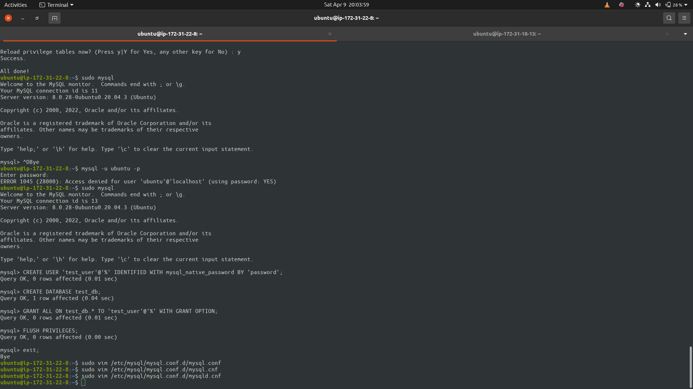
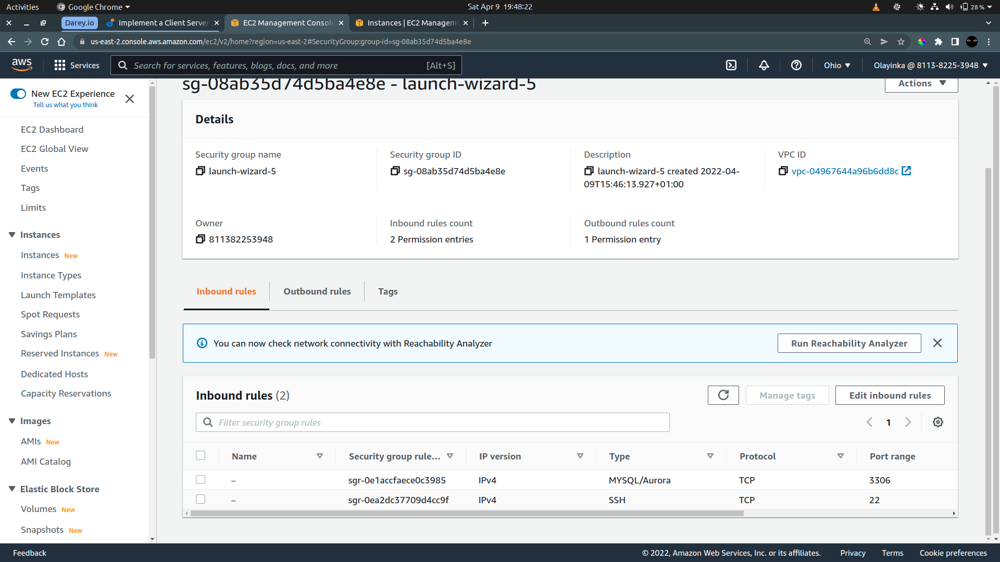
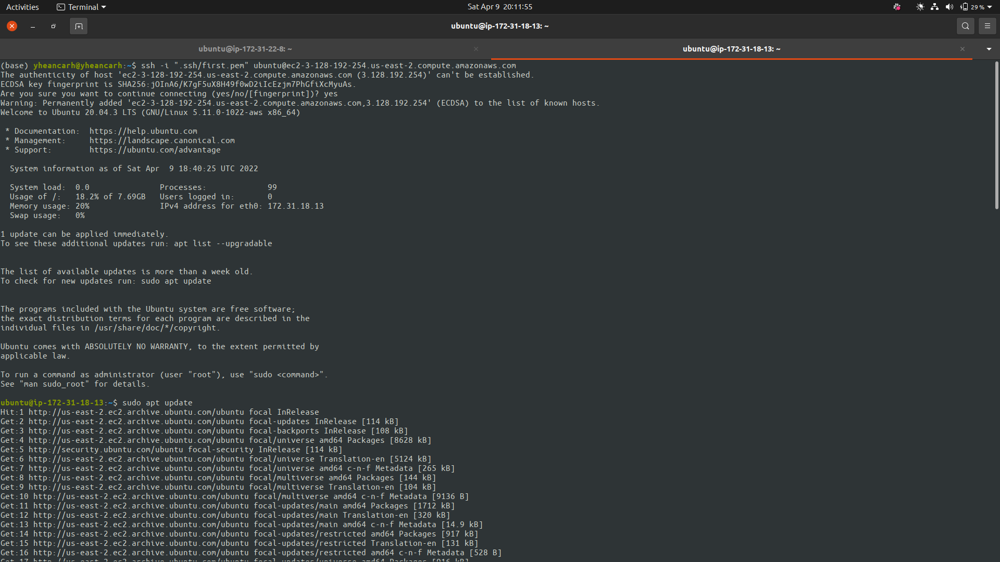
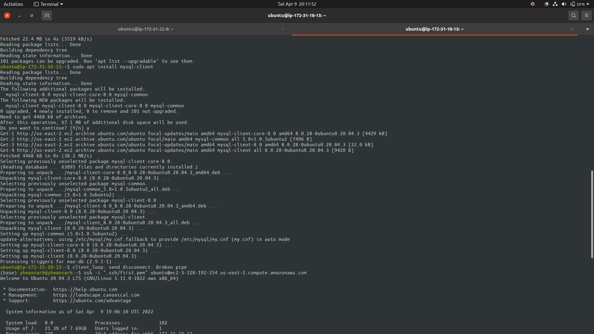
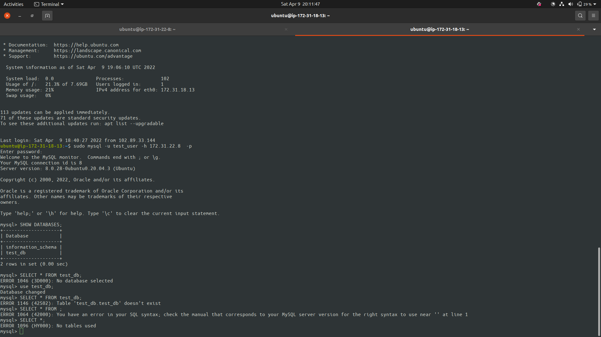

# CLIENT-SERVER ARCHITECTURE WITH MYSQL

## 1 - Create and Configure two EC2 Instances in AWS



## 2 - Install mysql-server software on A (mysql server) and configure mysql

```bash
	sudo apt install mysql-server

	sudo mysql

	sudo vim /etc/mysql/mysql.conf.d/mysqld.cnf
```









## 3 - Open the MySQL port on the security group to allow remote access to the database



## 4 - Install mysql-client software on A (mysql client) connect to the server


```bash
	sudo apt install mysql-client

	sudo mysql -u test_user -p
```







