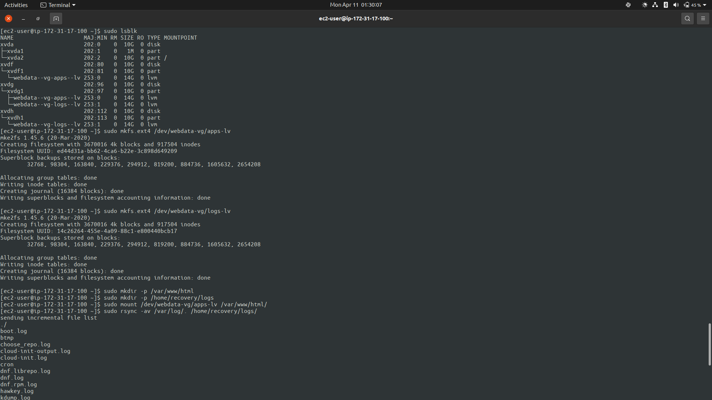
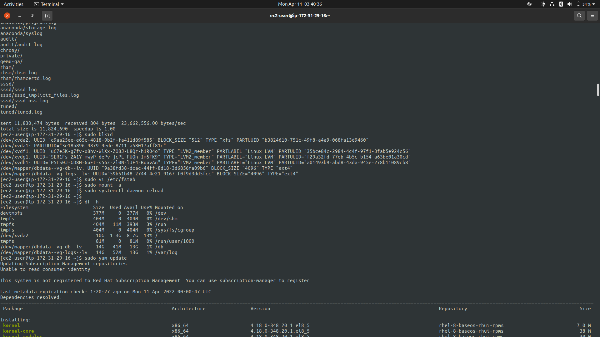

# WEB SOLUTION WITH WORDPRESS

## Prepare WEB Server


### Attach 3 Volumes of 10GB each in the AZ as the EC2 instnces


### Connect to the instance and create a single logical volume of the 3 volumes
```bash
# Inspect blockdevices attached to the server
lsblk

# Check mount points and free space
df -h

# Partition the 3 volumes as Linux LVM
sudo gdisk /dev/xvdf
sudo gdisk /dev/xvdg
sudo gdisk /dev/xvdh
```


```bash
# Check the new configured partitions
lsblk

# Install lvm2
sudo yum install lvm2

# Check available
sudo lvmdiskscan

# Mark each of the 3 volumes as physcal volume to be used by LVM
sudo pvcreate /dev/xvdf1
sudo pvcreate /dev/xvdg1
sudo pvcreate /dev/xvdh1

# Verify the physical volumes has been created successfully
sudo pvs

# Add all Physical volumes to one Volume Group
sudo vgcreate webdata-vg /dev/xvdf1 /dev/xvdg1 /dev/xvdh1

# Verify the Volume Group has been created
sudo vgs

# Create two Logical Volumes from the Volume Group
sudo lvcreate -n apps-lv -L 14G webdata-vg
sudo lvcreate -n logs-lv -L 14G webdata-vg

# Verify the Logical Volumes have been created
sudo lvs

# Verify the entire Setup
sudo vgdisplay -v
sudo lsblk

```


```bash
# Format the Logical volumes with ext4 FileSystem
sudo mkfs.ext4 /dev/webdata-vg/apps-lv
sudo mkfs.ext4 /dev/webdata-vg/logs-lv

# Create /var/www/html directory to store website files
sudo mkdir -p /var/www/html

# Create /home/recovery/logs directory to store backup of log data
sudo mkdir -p /home/recovery/logs

# Mount apps-lv on /var/www/html
sudo mount /dev/webdata-vg/apps-lv /var/www/html

# Backup /var/log/. to /home/recovery/logs using rsync
sudo rsync -av /var/log/. /home/recovery/logs

# Mount logs-lv on /var/log
sudo mount /dev/webdata-vg/logs-lv /var/log

# Restore log data
sudo rsync -av /home/recovery/logs/. /var/log

```



```bash
# Check the block id of the Logical volumes
sudo blkid

# Update the /etc/fstab file 
sudo vi /etc/fstab

# Test the configuration
sudo mount -a

# Restart the daemon
sudo systemctl daemon-reload
```


## Prepare the DB server
>	Repeat the steps for webserver but create a __db-lv__ instead of __apps-lv__, and mount it to __/db__ instead of __/var/www/html__ and name the volume group __dbdata-vg__ instead __webdata-vg__





## Install WordPress on the Web Server EC2

```bash
# Update the repository
sudo yum -y update

# Install wget, Apache and its dependencies
sudo yum -y install wget httpd php php-fpm php-mysqlnd php-json

# Start Apache
sudo systemctl enable httpd
sudo systemctl start httpd

# Install php and its dependencies
sudo yum install https://dl.fedoraproject.org/pub/epel/epel-release-latest-8.noarch.rpm

```


```bash
sudo yum install yum-utils http://rpms.remirepo.net/enterprise/remi-release-8.rpm

sudo yum module list php

sudo yum module reset php
```


```bash
sudo yum module enable php:remi-7.4

sudo yum install php-opcache php-gd php-curl
```


```bash
sudo systemctl enable php-fpm

sudo systemctl start php-fpm

sudo setsebool -P httpd_execmem 1

# Restart Apache 
sudo systemctl restart httpd

# Download WordPress
mkdir wordpress

cd wordpress

# download wordpress
sudo wget http://wordpress.org/latest.tar.gz

# Extract wordpress
sudo tar xzvf latest.tar.gz

# Install mysql
sudo yum install mysql
```


## Install MySQL on the DB Server

```bash
# Update repository
sudo yum -y update

# Install MySQL server
sudo yum install -y mysql-server
```


```bash
# Start mysql
sudo systemctl enable mysqld

sudo systemctl restart mysqld

sudo systemctl status mysqld

# Setup mysql and create user
sudo mysql
```


### Setup Wordpress
```bash
# Setup wordpress
cd wordpress

sudo cp wordpress/wp-config-sample.php wordpress/wp-config.php

# Copy wordpress files to the /var/www/html/ directory
sudo cp -R wordpress/. /var/www/html/

# Insert the database details
cd /var/www/html/

sudo vi wp-config.php

# Restart apache
sudo systemctl restsrt httpd
```


