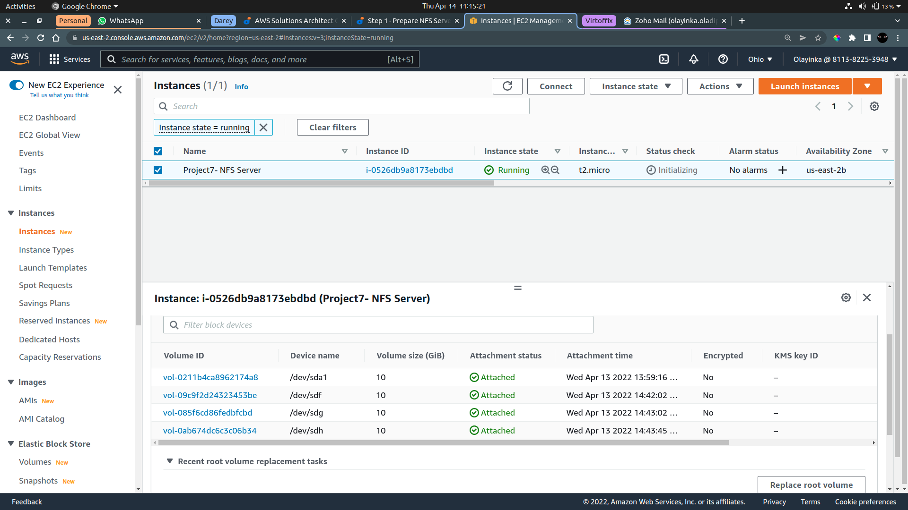
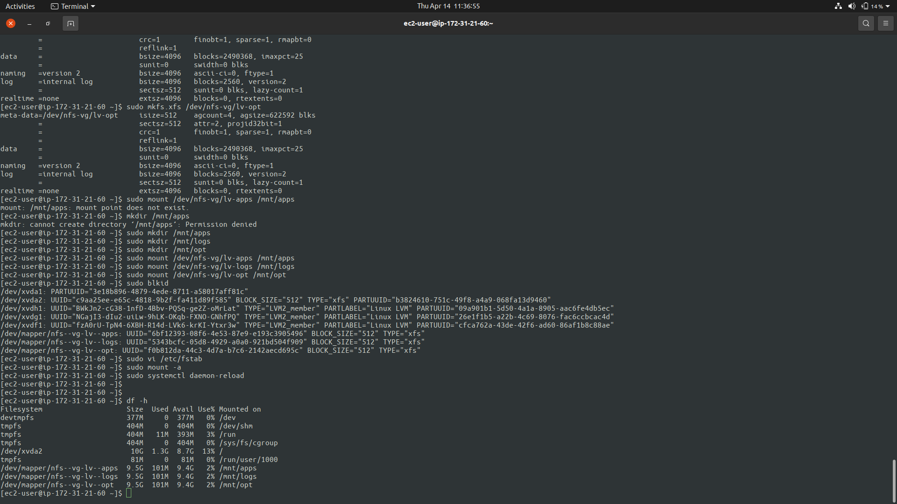
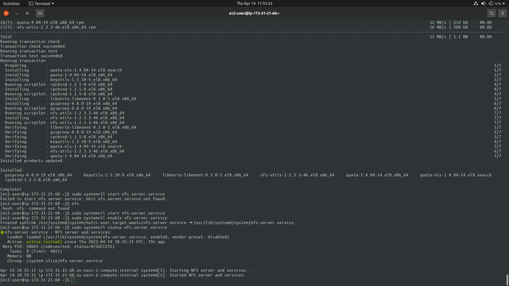
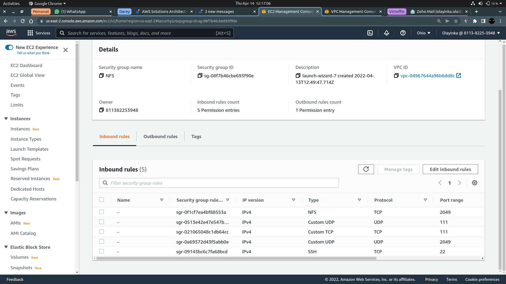
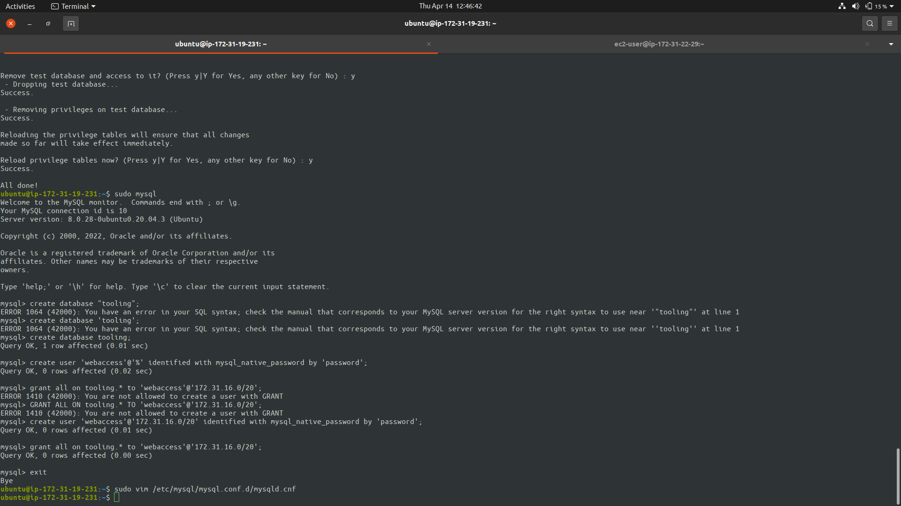
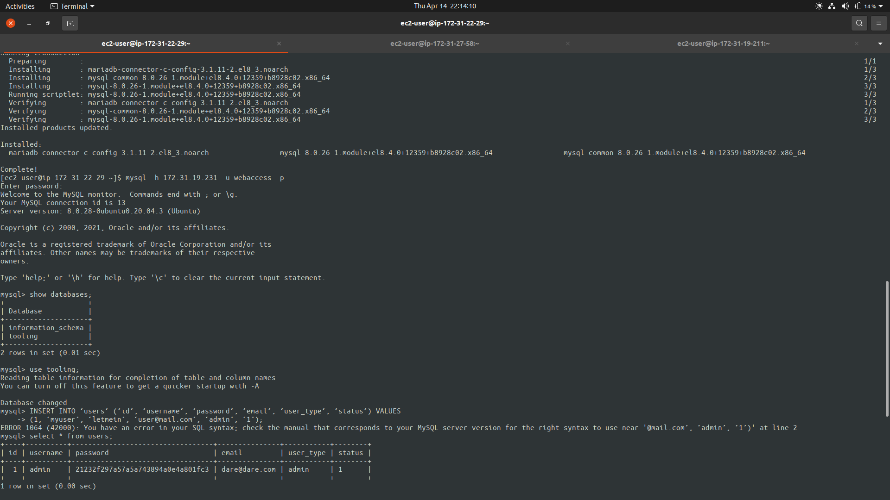
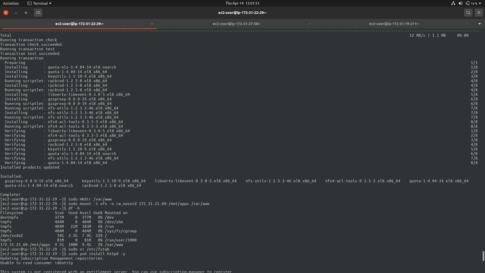
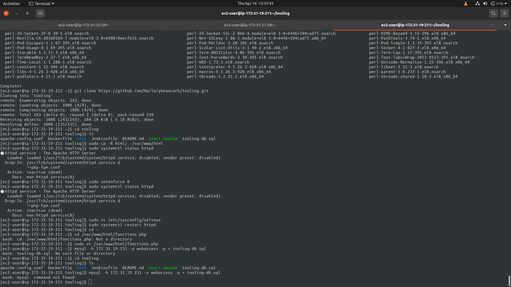
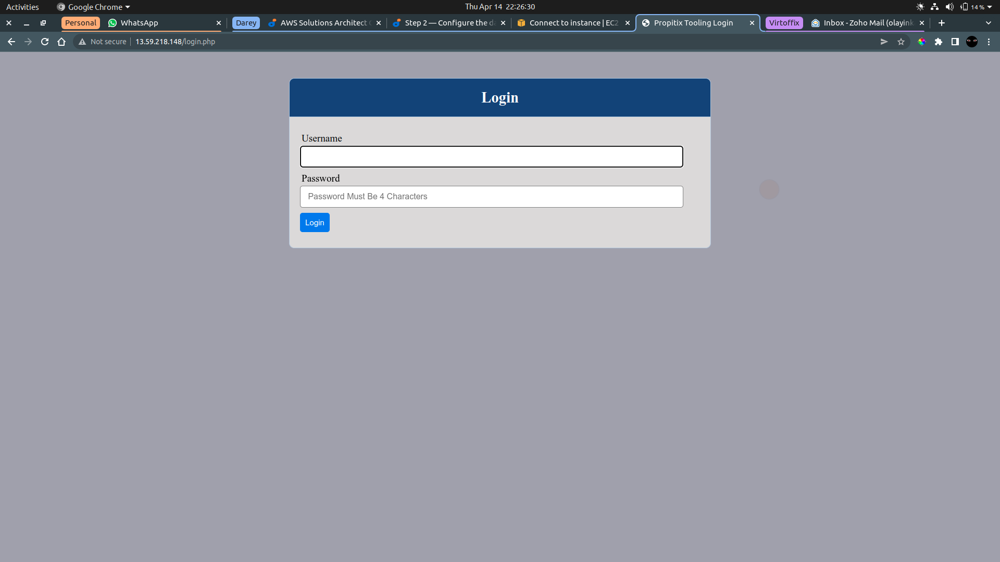
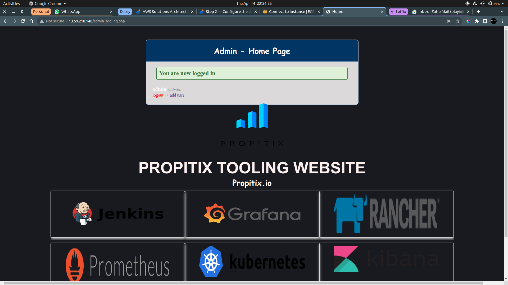

# DEVOPS TOOLING WEBSITE SOLUTION

### 1 Prepare NFS server

#### Configure LVM





#### Install NFS server 
```bash
sudo yum -y update
sudo yum install nfs-utils -y
sudo systemctl start nfs-server.service
sudo systemctl enable nfs-server.service
sudo systemctl status nfs-server.service
```


#### Permission enable rwx
```bash
sudo chown -R nobody: /mnt/apps
sudo chown -R nobody: /mnt/logs
sudo chown -R nobody: /mnt/opt

sudo chmod -R 777 /mnt/apps
sudo chmod -R 777 /mnt/logs
sudo chmod -R 777 /mnt/opt

sudo systemctl restart nfs-server.service
```

#### Configure access to NFS server
```bash
sudo vi /etc/exports

/mnt/apps <Subnet-CIDR>(rw,sync,no_all_squash,no_root_squash)
/mnt/logs <Subnet-CIDR>(rw,sync,no_all_squash,no_root_squash)
/mnt/opt <Subnet-CIDR>(rw,sync,no_all_squash,no_root_squash)

Esc + :wq!

sudo exportfs -arv
```

####  Check NFS port
```bash
rpcinfo -p | grep nfs
```

#### Set Inbound Rules for NFS



### 2 Prepare DB server






### 3 Prepare WEB servers

```bash
sudo yum install nfs-utils nfs4-acl-tools -y


sudo mkdir /var/www
sudo mount -t nfs -o rw,nosuid 172.31.21.60:/mnt/apps /var/www

df -h

sudo vi /etc/fstab < 172.31.21.60:/mnt/apps /var/www nfs defaults 0 0

# Apache
sudo yum install httpd -y

sudo dnf install https://dl.fedoraproject.org/pub/epel/epel-release-latest-8.noarch.rpm

sudo dnf install dnf-utils http://rpms.remirepo.net/enterprise/remi-release-8.rpm


# PHP
sudo dnf module reset php

sudo dnf module enable php:remi-7.4

sudo dnf install php php-opcache php-gd php-curl php-mysqlnd

sudo systemctl start php-fpm

sudo systemctl enable php-fpm

sudo setsebool -P httpd_execmem 1
```



#### Clone Git hub Repo And Set Up The Website
```bash
git clone https://github.com/Horleryheancarh.git

cd tooling

sudo cp html/. /var/www/html

# Disable SELinux
sudo setenforce 0

sudo vi /etc/sysconfig/selinux

# Edit DB details
sudo vi /var/www/html/functions.php

# Install MySQL

# Populate db
mysql -h <database-private-ip> -u webaccess -p < tooling-db.sql

```



#### Visit The Web URL






