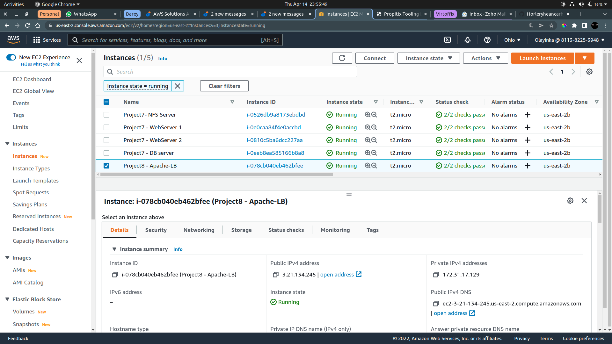
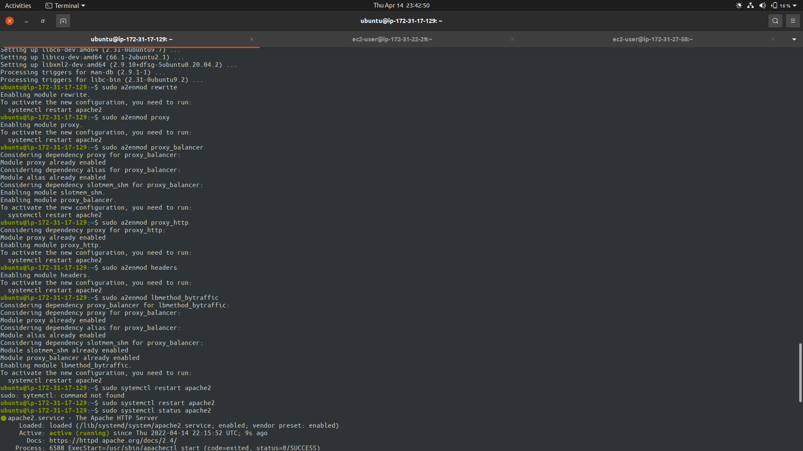
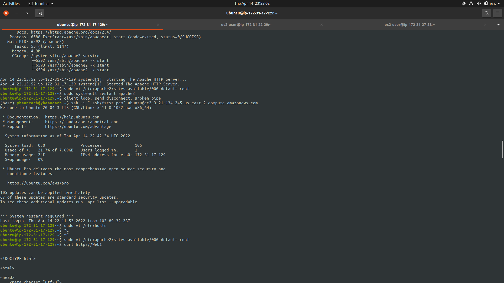
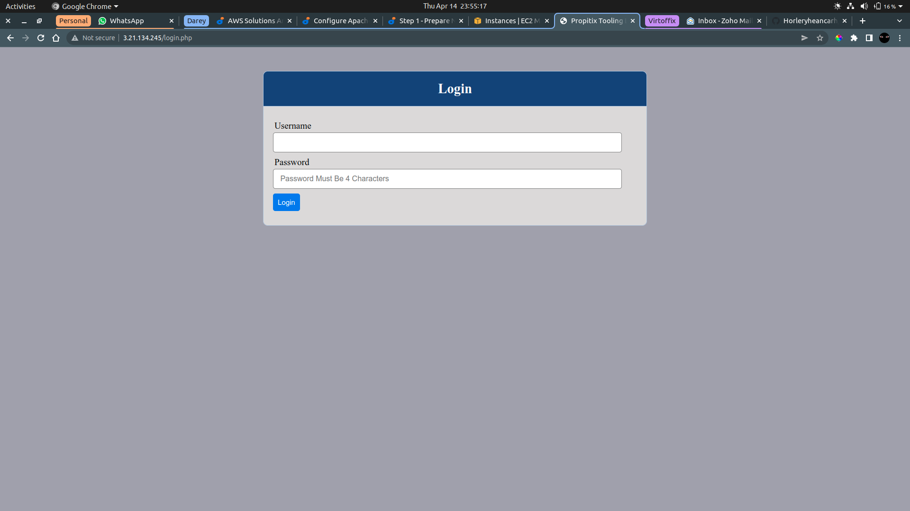

# LOAD BALANCER SOLUTION WITH APACHE

### Launch An EC2 Instance to serve as LB



### Install Apache Load Balancer And Configure It

```bash
#Install apache2
sudo apt update

sudo apt install apache2 -y

sudo apt-get install libxml2-dev

#Enable following modules
sudo a2enmod rewrite

sudo a2enmod proxy

sudo a2enmod proxy_balancer

sudo a2enmod proxy_http

sudo a2enmod headers

sudo a2enmod lbmethod_bytraffic

#Restart apache2 service
sudo systemctl restart apache2

#Ensure apache2 is up and running
sudo systemctl status apache2
```



### Configure Load Balancing

```bash
sudo vi /etc/apache2/sites-available/000-default.conf

#Add this configuration into this section <VirtualHost *:80>  </VirtualHost>

	<Proxy "balancer://mycluster">
		BalancerMember http://<WebServer1-Private-IP-Address>:80 loadfactor=5 timeout=1
		BalancerMember http://<WebServer2-Private-IP-Address>:80 loadfactor=5 timeout=1
		ProxySet lbmethod=bytraffic
		# ProxySet lbmethod=byrequests
	</Proxy>

        ProxyPreserveHost On
        ProxyPass / balancer://mycluster/
        ProxyPassReverse / balancer://mycluster/


#Restart apache server
sudo systemctl restart apache2
```

### Configure Local DNS Names Resolution

```bash

#Open this file on your LB server
sudo vi /etc/hosts


#Add 2 records into this file with Local IP address and arbitrary name for both of your Web Servers

<WebServer1-Private-IP-Address> Web1
<WebServer2-Private-IP-Address> Web2
```




### Accessing LB's public IP



