# Continous Integration Pipeline

## Install Jenkins server

### Create an EC2 Instance

> Add inbound Rule for port 8080

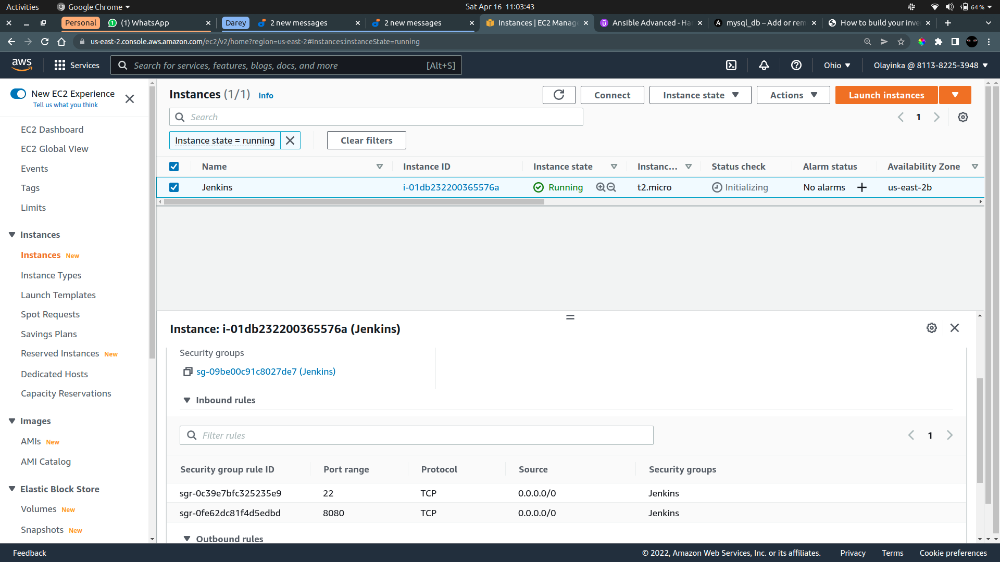

### Install Java JDK

```bash
sudo apt update

sudo apt install default-jdk-headless
```

### Install Jenkins

```bash
wget -q -O - https://pkg.jenkins.io/debian-stable/jenkins.io.key | sudo apt-key add -

sudo sh -c 'echo deb https://pkg.jenkins.io/debian-stable binary/ > /etc/apt/sources.list.d/jenkins.list'

sudo apt update

sudo apt install jenkins

# Verify Jenkins is running
sudo systemctl status jenkins

# Retrieve Jenkins initial password
sudo cat /var/lib/jenkins/secrets/initialAdminPassword
```

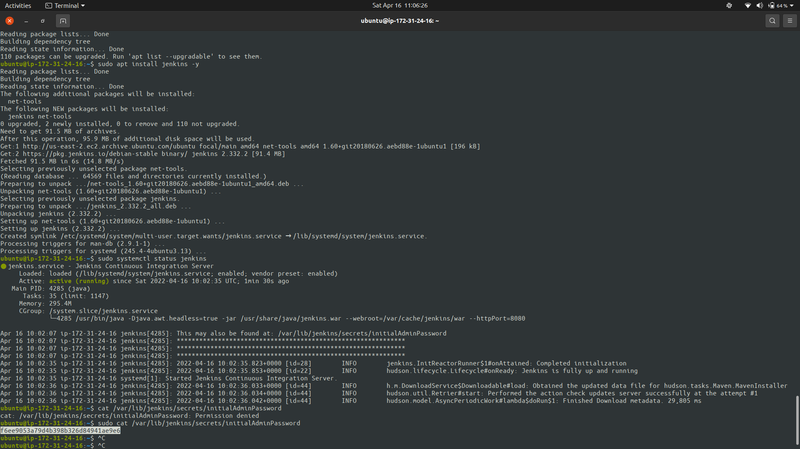

### Configure Jenkins

## Configure Jenkins To Retrieve Source Code From Github Using WebHooks

### Enable Webhook on the Github Repository

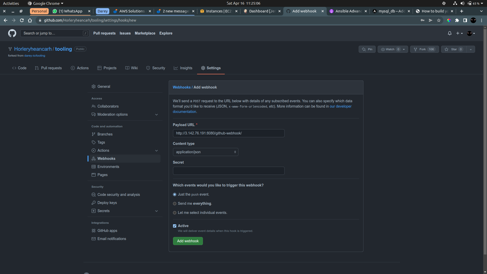

### Create a new Freestyle project on Jenkins

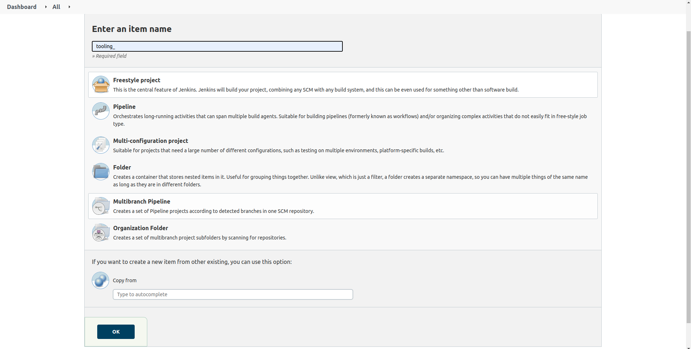

### Add Github Repository

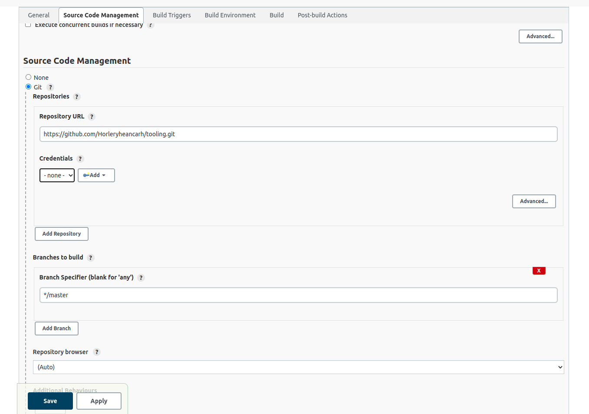

### Build The Project

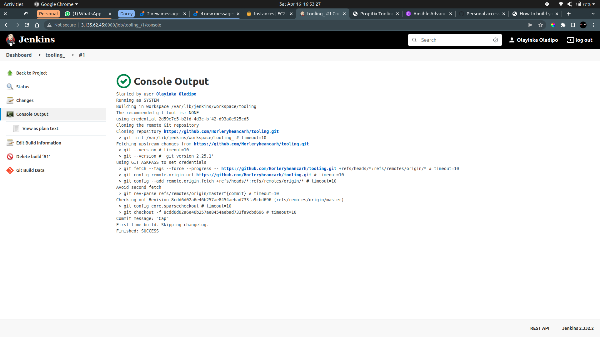

### Configure triggering the build from github and Post-Build-Actions to archive all the files

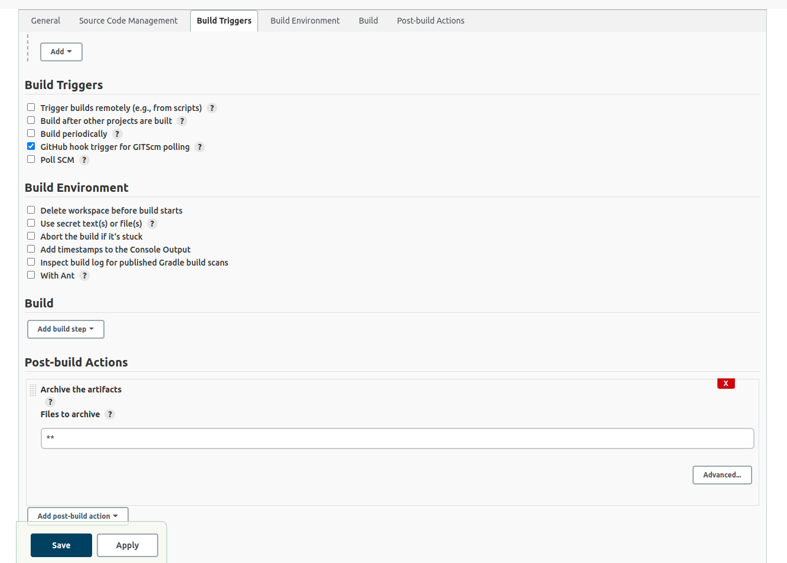

### Test the Configuration

> Make Some changes in the repository and commit to Github

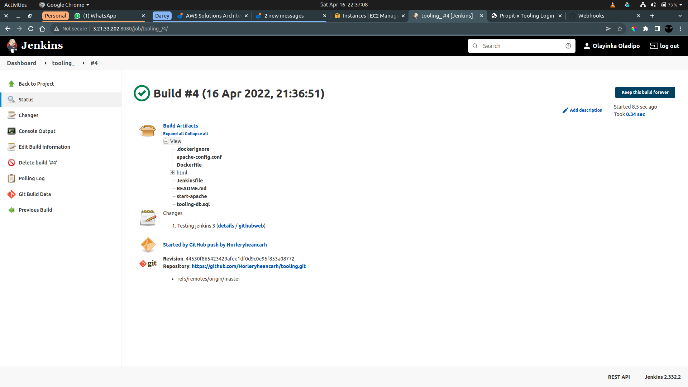

## Configure Jenkins To Copy Files To NFS Server Over SSH

### Install "Publish-Over-SSH" Plugin

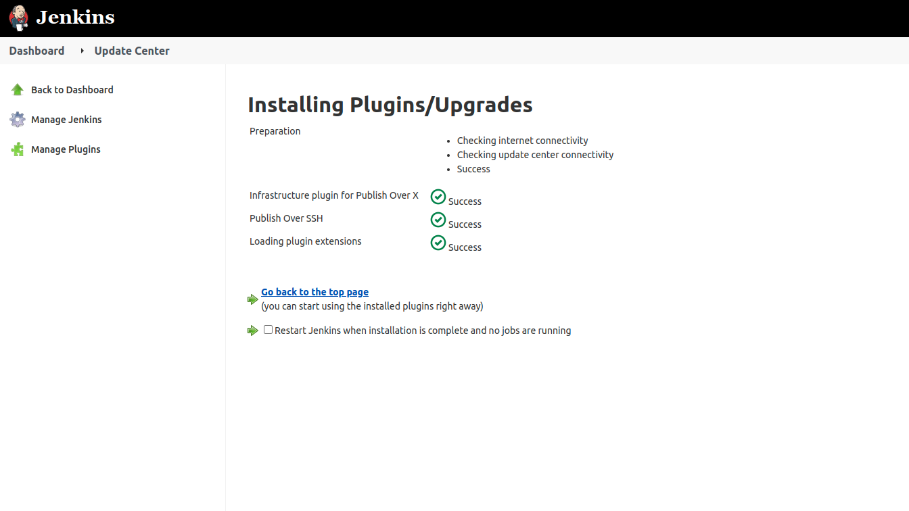

### Configure the project to copy artifacts over to NFS server

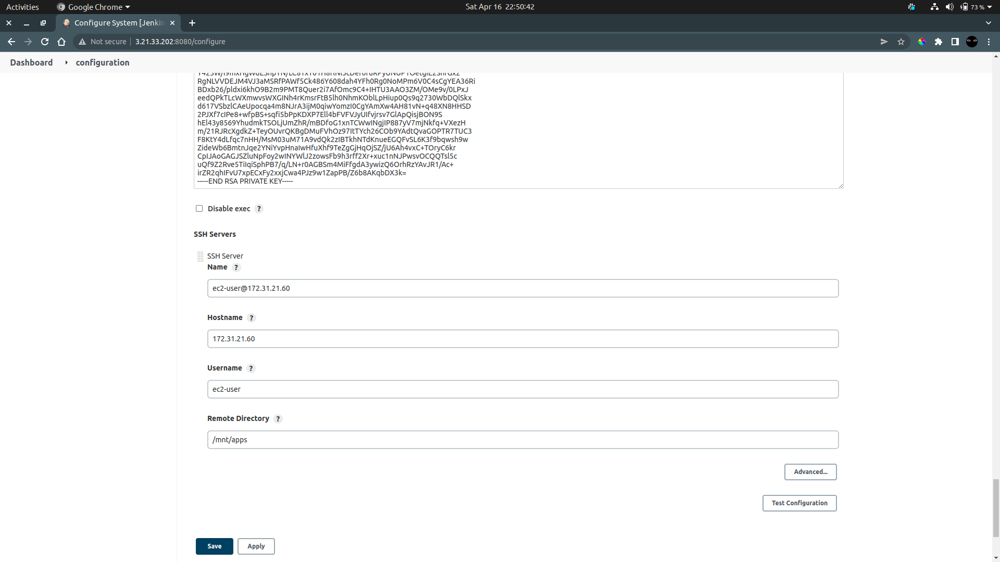

### Add Post-Build-Action to send all archive files to the NFS server

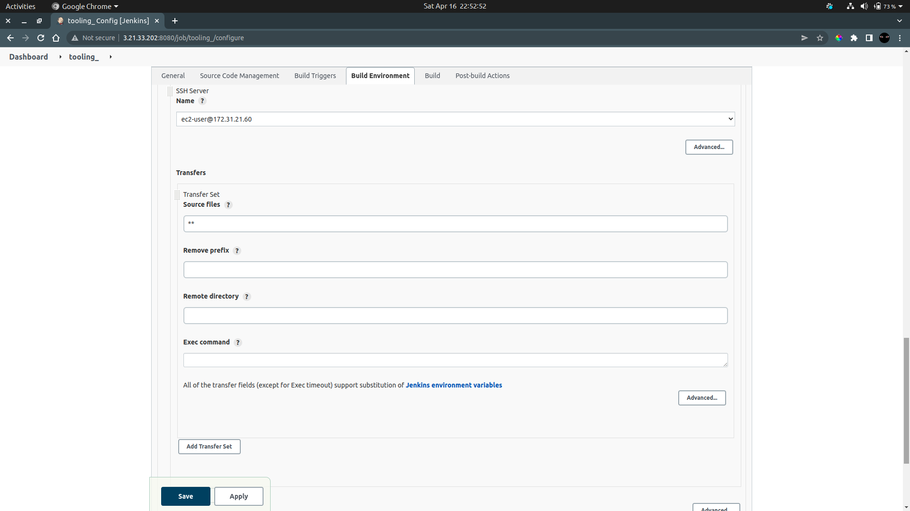

## Test The Configuration

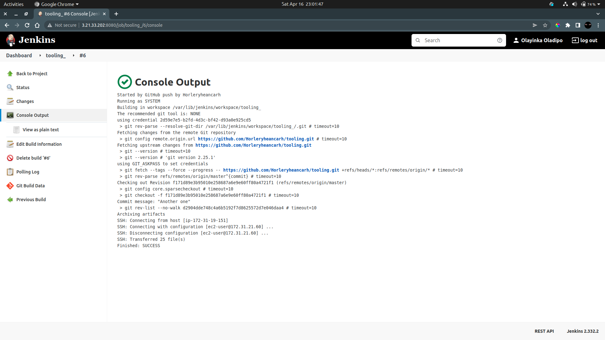

### Check the Files in the NFS server

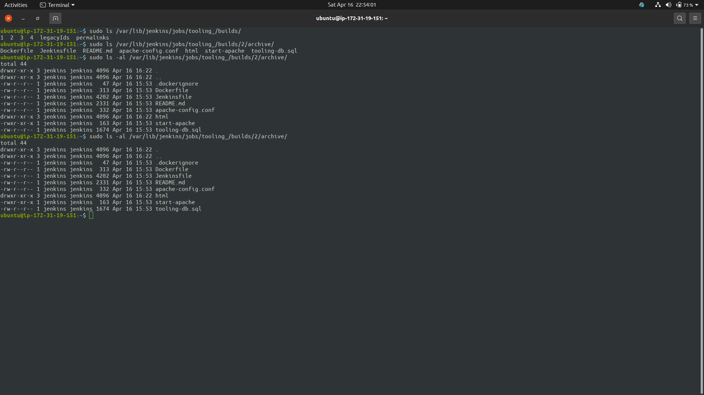

